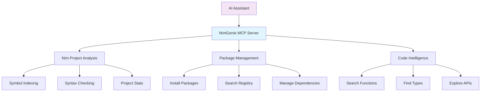
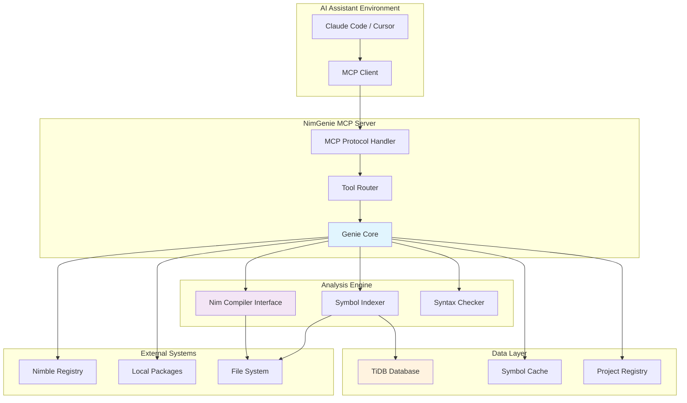
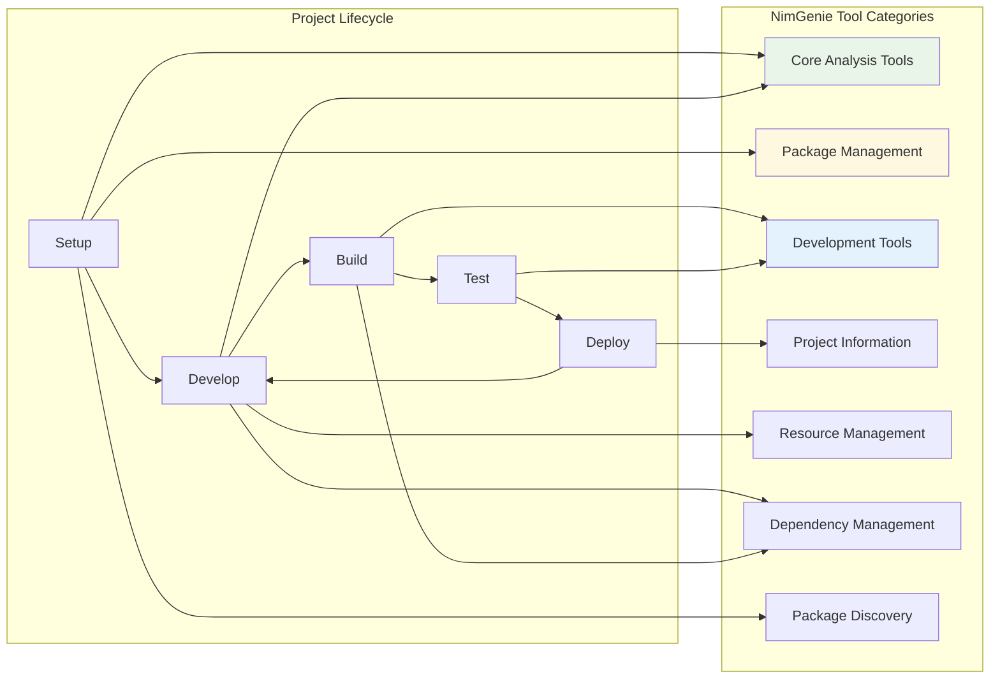
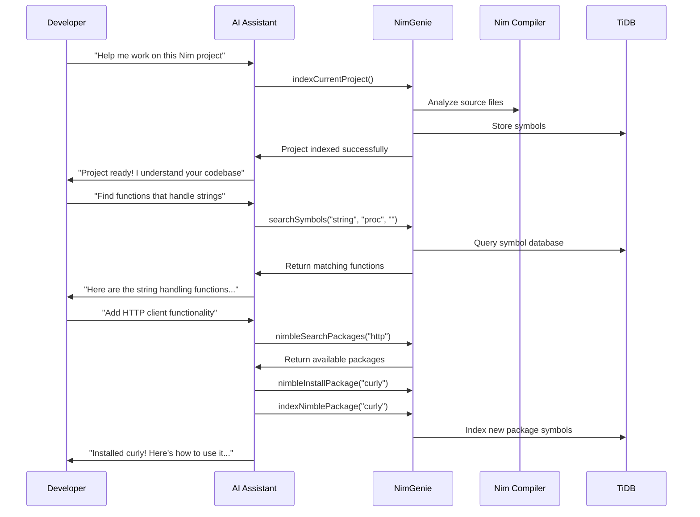

# NimGenie Tutorial: AI-Powered Nim Development

Welcome to NimGenie! This comprehensive tutorial shows you how to supercharge your Nim programming with AI assistants like Claude Code, Cursor, and other MCP-compatible tools.

## Table of Contents

1. [What is NimGenie?](#what-is-nimgenie)
2. [Setup & Installation](#setup--installation)
3. [Core Workflows](#core-workflows)
4. [Practical Examples](#practical-examples)
5. [Architecture Overview](#architecture-overview)
6. [Advanced Use Cases](#advanced-use-cases)
7. [Tips & Best Practices](#tips--best-practices)
8. [Troubleshooting](#troubleshooting)

## What is NimGenie?

NimGenie is a comprehensive MCP (Model Context Protocol) server that makes AI assistants incredibly effective at working with Nim projects. It provides 23 specialized tools organized into 7 categories:

- **Core Project Analysis** (6 tools): Indexing, symbol search, syntax checking
- **Directory Resource Management** (3 tools): File serving and resource access
- **Nimble Package Discovery** (2 tools): Package discovery and indexing
- **Package Management** (5 tools): Installing, searching, managing packages
- **Project Development** (5 tools): Building, testing, running projects
- **Dependency Management** (3 tools): Managing project dependencies
- **Project Information** (5 tools): Querying project metadata and status

### Why Use NimGenie?



**Key Benefits:**
- 🔍 **Intelligent Code Search**: Find any symbol across your entire project and dependencies
- 📦 **Package Intelligence**: Discover, install, and understand Nimble packages effortlessly  
- 🏗️ **Project Management**: Build, test, and manage Nim projects with AI guidance
- 📚 **Deep Code Understanding**: AI assistants can read and understand your entire codebase
- ⚡ **Instant Analysis**: Real-time syntax checking and semantic analysis

## Setup & Installation

### Prerequisites

1. **Nim 2.2.4+** installed and working
2. **TiDB** for persistent symbol storage (development setup)
3. **AI Assistant** with MCP support (Claude Code, Cursor, etc.)

### Installation Steps

#### 1. Install NimGenie

```bash
# Clone the repository
git clone https://github.com/gokr/nimgenie
cd nimgenie

# Build NimGenie
nimble build
```

#### 2. Set up TiDB (for development)

```bash
# Install TiUP (if not already installed)
curl --proto '=https' --tlsv1.2 -sSf https://tiup-mirrors.pingcap.com/install.sh | sh

# Start TiDB playground
tiup playground
```

#### 3. Configure Your AI Assistant

**For Claude Code:**
Add to your MCP settings:

```json
{
  "servers": {
    "nimgenie": {
      "command": "/path/to/nimgenie/nimgenie",
      "args": ["--port", "8080"]
    }
  }
}
```

#### 4. Test the Installation

```bash
# Start NimGenie in your Nim project directory
cd /path/to/your/nim/project
/path/to/nimgenie/nimgenie

# You should see:
# Starting NimGenie MCP server on localhost:8080 for project: /path/to/your/nim/project
```

## Core Workflows

### 1. Project Discovery & Setup

**The Problem**: You're starting work on a new Nim project and want your AI assistant to understand the entire codebase.

**The Solution**: Use NimGenie's indexing tools to analyze everything.

#### Example AI Conversation:

**You**: "I want to work on this Nim project. Help me understand what it does and how it's structured."

**AI Assistant**: I'll help you analyze this Nim project! Let me start by indexing the project and its dependencies to understand the codebase structure.

*AI uses: `indexCurrentProject()`*

**AI Assistant**: Great! I've indexed your project. Let me get some statistics about what we're working with.

*AI uses: `getProjectStats()`*

**AI Assistant**: Based on the analysis, this project has:
- X source files with Y symbols total
- Z dependencies including packages like [list]
- Main modules: [module names]
- Project type: [library/executable/hybrid]

Let me also check the project status to understand the current setup.

*AI uses: `nimbleProjectStatus()`*

**AI Assistant**: Now I have a complete understanding of your project! Here's what I found:
[Detailed explanation of project structure, dependencies, and capabilities]

Would you like me to explore any specific part of the codebase or help with a particular task?

### 2. Code Exploration & API Discovery

**The Problem**: You need to find specific functionality or understand how certain features work.

#### Example AI Conversation:

**You**: "I need to add HTTP client functionality to my project. Show me what's available and help me choose the right approach."

**AI Assistant**: I'll help you explore HTTP client options! Let me search for existing HTTP-related functionality and available packages.

*AI uses: `searchSymbols("http", "", "")`*

**AI Assistant**: I found some HTTP-related symbols in your current codebase. Now let me search for available HTTP client packages in the Nimble registry.

*AI uses: `nimbleSearchPackages("http client")`*

**AI Assistant**: Here are the best HTTP client options for Nim:

1. **httpx** - Modern async HTTP client
2. **curly** - Simple synchronous HTTP client  
3. **httpclient** - Standard library HTTP client

Based on your project structure, I recommend `curly` for simplicity. Let me install it and show you how to use it.

*AI uses: `nimbleInstallPackage("curly", "")`*

**AI Assistant**: Perfect! I've installed curly. Now let me index it so we can explore its API.

*AI uses: `indexNimblePackage("curly")`*

*AI uses: `searchSymbols("get", "proc", "curly")`*

**AI Assistant**: Here's how to use curly for HTTP requests:

```nim
import curly

# Simple GET request
let response = curly.get("https://api.example.com/data")
echo response.body

# POST with JSON data
let postResponse = curly.post("https://api.example.com/submit", 
                              headers = {"Content-Type": "application/json"},
                              body = """{"key": "value"}""")
```

Would you like me to help you integrate this into your specific use case?

### 3. Development & Debugging

**The Problem**: You're implementing a feature and need help with syntax, debugging, or testing.

#### Example AI Conversation:

**You**: "I'm getting compilation errors in my project. Help me fix them and add proper error handling."

**AI Assistant**: I'll help you debug the compilation issues! Let me check the syntax of your project first.

*AI uses: `checkSyntax()`*

**AI Assistant**: I found several compilation errors:

1. Line 45: `undefined identifier 'processData'`
2. Line 67: `type mismatch: expected string, got int`  
3. Line 89: `missing import for json module`

Let me search your codebase to understand the context and find the right solutions.

*AI uses: `searchSymbols("processData", "", "")`*

**AI Assistant**: I see the issue! The `processData` function is defined in the `utils` module but not imported. Here's how to fix these errors:

```nim
# Add these imports at the top of your file
import json, strutils
import utils  # This contains processData

# Fix the type mismatch on line 67
let result = processData($inputNumber)  # Convert int to string

# Add proper error handling
try:
  let data = parseJson(jsonString)
  let result = processData(data["field"].getStr())
except JsonParsingError:
  echo "Error: Invalid JSON format"
except KeyError:
  echo "Error: Missing required field"
```

Now let me check if the syntax is correct:

*AI uses: `checkSyntax()`*

**AI Assistant**: Excellent! All syntax errors are resolved. Would you like me to help you add unit tests for this functionality?

### 4. Package & Dependency Management

**The Problem**: You need to manage project dependencies, explore packages, or set up a new project.

#### Example AI Conversation:

**You**: "I want to create a new web API project with proper testing. Set it up with the best practices and packages."

**AI Assistant**: I'll help you create a professional web API project! Let me set up a new project with the right structure and dependencies.

*AI uses: `nimbleInitProject("my-web-api", "bin")`*

**AI Assistant**: Great! I've created your new web API project. Now let me search for the best packages for web development and testing.

*AI uses: `nimbleSearchPackages("web framework")`*
*AI uses: `nimbleSearchPackages("testing")`*

**AI Assistant**: I recommend these packages for your web API:

1. **jester** - Lightweight web framework
2. **unittest2** - Advanced testing framework  
3. **json** - JSON handling (standard library)

Let me install them:

*AI uses: `nimbleInstallPackage("jester", "")`*
*AI uses: `nimbleInstallPackage("unittest2", "")`*

**AI Assistant**: Now let me index these packages so we can explore their APIs:

*AI uses: `indexNimblePackage("jester")`*
*AI uses: `indexNimblePackage("unittest2")`*

*AI uses: `searchSymbols("get", "template", "jester")`*
*AI uses: `searchSymbols("test", "template", "unittest2")`*

**AI Assistant**: Perfect! Here's your project structure with example code:

```nim
# src/my_web_api.nim
import jester, json

routes:
  get "/api/health":
    resp Http200, %*{"status": "healthy", "timestamp": now()}
  
  get "/api/users/@id":
    let userId = @"id"
    # Your user logic here
    resp Http200, %*{"user": userId}

when isMainModule:
  let port = Port(8080)
  echo "Starting web API on port ", port
  serve(port)
```

```nim
# tests/test_api.nim
import unittest2, json, httpclient
import ../src/my_web_api

suite "Web API Tests":
  test "health endpoint returns 200":
    let client = newHttpClient()
    let response = client.get("http://localhost:8080/api/health")
    check response.status == Http200
    
    let data = parseJson(response.body)
    check data["status"].getStr() == "healthy"
```

Let me build and test the project:

*AI uses: `nimbleBuildProject()`*
*AI uses: `nimbleTestProject()`*

**AI Assistant**: Your web API project is ready! The build succeeded and all tests pass. You can run it with:

```bash
nimble run
```

Would you like me to help you add more endpoints or implement specific features?

## Practical Examples

### Example 1: Contributing to an Open Source Project

**Scenario**: You want to contribute to an existing Nim project on GitHub.

```bash
# Clone the project
git clone https://github.com/nim-lang/someproject
cd someproject

# Start NimGenie
nimgenie
```

**AI Conversation**:

**You**: "I want to contribute to this project by adding a new feature. Help me understand the codebase and find where to make changes."

**AI Assistant**: I'll help you explore this project and understand how to contribute effectively!

*AI uses: `indexCurrentProject()`*
*AI uses: `getProjectStats()`*
*AI uses: `nimbleShowDependencies(true)`*

**AI Assistant**: This is a [project analysis]. The codebase has [statistics]. 

Let me search for similar functionality to understand the patterns:

*AI uses: `searchSymbols("similar_feature", "", "")`*

**AI Assistant**: Based on the codebase patterns, here's where you should implement your new feature:

1. **Core logic**: Add to `src/core/[module].nim`
2. **Tests**: Create `tests/test_new_feature.nim`
3. **Documentation**: Update `docs/[relevant].md`

Here's a template following the project's conventions:

```nim
# Following the project's style and patterns
proc newFeature*(input: InputType): ResultType =
  ## Add your new feature here
  # Implementation following project patterns
```

Would you like me to help you implement the specific feature you have in mind?

### Example 2: Performance Optimization

**Scenario**: Your Nim application is slow and you need to optimize it.

**You**: "My application is running slowly. Help me identify performance bottlenecks and optimize the code."

**AI Assistant**: I'll help you identify and fix performance issues! Let me analyze your codebase for potential bottlenecks.

*AI uses: `searchSymbols("", "proc", "")`*
*AI uses: `getProjectStats()`*

**AI Assistant**: I found several areas to investigate for performance:

1. **Hot paths**: Functions called frequently
2. **Memory allocation**: String operations, sequences
3. **I/O operations**: File and network access

Let me search for specific patterns that often cause performance issues:

*AI uses: `searchSymbols("string", "proc", "")`*
*AI uses: `searchSymbols("seq", "type", "")`*

**AI Assistant**: Here are the optimization opportunities I found:

```nim
# Before: Inefficient string concatenation
proc buildMessage(items: seq[string]): string =
  for item in items:
    result = result & item & "\n"  # Inefficient!

# After: Efficient string building
proc buildMessage(items: seq[string]): string =
  var parts = newSeqOfCap[string](items.len)
  for item in items:
    parts.add(item)
  return parts.join("\n")
```

Let me also check for packages that could help with performance:

*AI uses: `nimbleSearchPackages("performance optimization")`*

**AI Assistant**: I recommend profiling your application with these tools and techniques:

1. Use `--profiler:on` compiler flag
2. Add timing measurements to hot paths
3. Consider the `stint` library for high-performance integers

Would you like me to help you implement specific optimizations?

### Example 3: Testing Strategy

**Scenario**: You need to improve test coverage and testing practices.

**You**: "I want to add comprehensive testing to my project. Show me what's already tested and help me add more test coverage."

**AI Assistant**: I'll help you analyze and improve your testing strategy!

*AI uses: `searchSymbols("test", "", "")`*
*AI uses: `searchSymbols("", "proc", "")`*

**AI Assistant**: I found your current test coverage:

**Tested modules**: [list of tested areas]
**Untested functions**: [list of functions without tests]

Let me search for testing-related packages:

*AI uses: `nimbleSearchPackages("testing")`*
*AI uses: `nimbleListPackages(true)`*

**AI Assistant**: Here's a comprehensive testing strategy for your project:

```nim
# tests/test_comprehensive.nim
import unittest2, times
import ../src/your_module

suite "Comprehensive Module Tests":
  setup:
    # Setup code run before each test
    discard
  
  teardown:
    # Cleanup code run after each test
    discard

  test "function handles normal input":
    let result = yourFunction("normal input")
    check result == "expected output"
  
  test "function handles edge cases":
    expect(ValueError):
      discard yourFunction("invalid input")
  
  test "performance requirements":
    let startTime = cpuTime()
    let result = yourFunction("performance test")
    let duration = cpuTime() - startTime
    check duration < 0.1  # Must complete in < 100ms
```

Let me run your existing tests to see the current status:

*AI uses: `nimbleTestProject()`*

**AI Assistant**: Your test results: [results]. Here are the areas that need more test coverage:

1. **Error handling paths**
2. **Edge cases and boundary conditions**
3. **Performance requirements**
4. **Integration tests**

Would you like me to help you write tests for any specific functionality?

## Architecture Overview

### NimGenie System Architecture



### Tool Categories & Workflow



### Typical Development Workflow



## Advanced Use Cases

### 1. Multi-Project Development

When working on multiple related Nim projects (e.g., a web service and its client library):

```bash
# Terminal 1: Main service
cd /path/to/web-service
nimgenie --port 8080

# Terminal 2: Client library  
cd /path/to/client-lib
nimgenie --port 8081
```

**AI Assistant Usage:**
```
AI can now understand both projects simultaneously and help you:
- Keep APIs in sync between service and client
- Share common types and structures
- Manage dependencies between projects
- Coordinate testing across both codebases
```

### 2. Large Codebase Navigation

For large projects with hundreds of modules:

**You**: "This codebase is huge. Help me understand the architecture and find where authentication is handled."

*AI uses multiple tools to map the architecture:*
- `getProjectStats()` - Understand scale
- `searchSymbols("auth", "", "")` - Find auth-related code
- `searchSymbols("login", "", "")` - Find login functionality
- `searchSymbols("token", "", "")` - Find token handling

### 3. Legacy Code Modernization

**You**: "This Nim project is using old patterns. Help me modernize it to current best practices."

*AI analyzes patterns and suggests improvements:*
- Identifies deprecated language features
- Suggests modern library alternatives
- Helps refactor to current idioms
- Updates dependency management

### 4. Performance Analysis at Scale

**You**: "Profile this entire application and find all performance bottlenecks."

*AI systematically analyzes:*
- All function signatures for complexity indicators
- Memory allocation patterns
- I/O operation locations
- Dependency analysis for heavy libraries

## Tips & Best Practices

### 🚀 Getting Started Right

1. **Always index first**: Run `indexCurrentProject()` when starting work on any Nim project
2. **Update dependencies**: Use `indexProjectDependenciesOnly()` when dependencies change
3. **Check project status**: Use `nimbleProjectStatus()` to understand project health

### 🔍 Effective Code Search

1. **Start broad, then narrow**: 
   - Search `searchSymbols("http", "", "")` first
   - Then `searchSymbols("http", "proc", "mymodule")` for specifics

2. **Use symbol types effectively**:
   - `"proc"` for functions and methods
   - `"type"` for custom types and objects
   - `"const"` for constants
   - `"var"` for variables
   - `"template"` for templates
   - `"macro"` for macros

3. **Explore packages before using**:
   ```
   nimbleSearchPackages("web framework")
   nimblePackageInfo("jester")
   nimblePackageVersions("jester")
   ```

### 📦 Package Management

1. **Research before installing**:
   ```
   nimbleSearchPackages("http client")
   nimblePackageInfo("curly")
   nimblePackageVersions("curly")
   nimbleInstallPackage("curly", ">= 1.0.0")
   ```

2. **Keep dependencies clean**:
   ```
   nimbleShowDependencies(true)  # See dependency tree
   nimbleUpgradePackages()       # Keep packages updated
   ```

3. **Index new packages immediately**:
   ```
   nimbleInstallPackage("newpackage")
   indexNimblePackage("newpackage")  # Make it searchable
   ```

### 🏗️ Development Workflow

1. **Continuous validation**:
   - Use `checkSyntax()` frequently during development
   - Run `nimbleTestProject()` before commits
   - Use `nimbleBuildProject()` to verify compilation

2. **Resource management**:
   - Use `addDirectoryResource()` for docs, assets, examples
   - `listDirectoryResources()` to see what's available
   - Organize project files for AI assistant access

### 🧪 Testing Strategy

1. **Comprehensive testing**:
   ```
   nimbleTestProject()                    # Run all tests
   nimbleTestProject("test_specific")     # Run specific tests
   nimbleBuildProject("", "debug")        # Debug builds for testing
   ```

2. **Performance testing**:
   - Use timing in tests
   - Profile with `--profiler:on`
   - Monitor memory usage patterns

### ⚡ Performance Optimization

1. **AI-assisted optimization**:
   - Let AI search for performance patterns
   - Ask for specific optimization suggestions
   - Use AI to find alternative algorithms

2. **Systematic approach**:
   ```
   # Search for potential bottlenecks
   searchSymbols("string", "proc", "")  # String operations
   searchSymbols("seq", "type", "")     # Sequence usage
   searchSymbols("array", "type", "")   # Array usage
   ```

### 🔧 Development Environment

1. **Consistent setup**:
   - Always run NimGenie from project root
   - Use `--verbose` for debugging setup issues
   - Keep TiDB running for best performance

2. **Multiple projects**:
   - Use different ports for different projects
   - Share database for symbol search across projects
   - Use project-specific configurations

## Troubleshooting

### Common Issues

#### 1. NimGenie Won't Start

**Problem**: `Error: Database connection failed`

**Solution**:
```bash
# Start TiDB first
tiup playground

# Then start NimGenie
nimgenie --verbose
```

#### 2. Indexing Fails

**Problem**: `Failed to index project: permission denied`

**Solution**:
```bash
# Check file permissions
ls -la src/

# Run from project root
cd /your/project/root
nimgenie
```

#### 3. Symbols Not Found

**Problem**: AI can't find symbols you know exist

**Solution**:
1. Re-index the project:
   ```
   indexCurrentProject()
   ```

2. Check if dependencies are indexed:
   ```
   listNimblePackages()
   indexNimblePackage("package_name")
   ```

3. Verify symbol search:
   ```
   searchSymbols("symbol_name", "", "")
   ```

#### 4. Package Installation Issues

**Problem**: `nimbleInstallPackage` fails

**Solution**:
1. Update package list:
   ```
   nimbleRefreshPackages()
   ```

2. Check package exists:
   ```
   nimbleSearchPackages("package_name")
   ```

3. Try specific version:
   ```
   nimbleInstallPackage("package", ">= 1.0.0")
   ```

#### 5. Performance Issues

**Problem**: NimGenie responses are slow

**Solutions**:
1. **Database optimization**:
   - Ensure TiDB is running locally
   - Check database connection pooling
   - Monitor database size

2. **Cache optimization**:
   - Restart NimGenie to clear cache
   - Use specific searches instead of broad ones

3. **Project size**:
   - Index only necessary dependencies
   - Use `indexProjectDependenciesOnly()` for updates

### Getting Help

1. **Verbose logging**:
   ```bash
   nimgenie --verbose --port 8080
   ```

2. **Check project status**:
   ```
   nimbleProjectStatus()
   getProjectStats()
   ```

3. **Database diagnostics**:
   ```
   listDirectoryResources()
   listNimblePackages()
   ```

4. **AI Assistant diagnostics**:
   - Ask AI to run multiple diagnostic commands
   - Compare results with expected behavior
   - Use AI to interpret error messages

---

## Conclusion

NimGenie transforms AI-assisted Nim development by providing deep code understanding, intelligent package management, and comprehensive project analysis. With 23 specialized tools and persistent symbol indexing, your AI assistant becomes an expert Nim developer that understands your entire codebase.

### Next Steps

1. **Install NimGenie** and try the basic workflows
2. **Index your current project** and explore the symbol search
3. **Experiment with package management** for your next feature
4. **Share your experience** and contribute to the project

Happy coding with NimGenie! 🎉

---

*This tutorial covers NimGenie v0.1.0. For the latest updates and features, visit the [GitHub repository](https://github.com/gokr/nimgenie).*