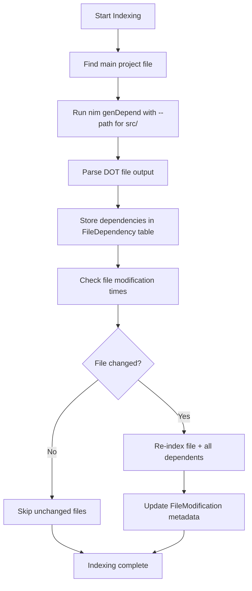

# NimGenie Manual v0.2.0

**MCP Server for AI-assisted Nim Programming**

## Table of Contents

1. [Introduction](#1-introduction)
2. [Quick Start](#2-quick-start)
3. [Architecture Overview](#3-architecture-overview)
4. [Installation & Configuration](#4-installation--configuration)
5. [Tutorial & Examples](#5-tutorial--examples)
6. [MCP Tool Reference](#6-mcp-tool-reference)
7. [Vector Embedding System](#7-vector-embedding-system)
8. [External Database Integration](#8-external-database-integration)
9. **[Output Schema Reference](#9-output-schema-reference)** - JSON schemas for all tools
10. [Advanced Topics](#10-advanced-topics)
11. [Testing Guide](#11-testing-guide)
12. [Development Guidelines](#12-development-guidelines)

---

## 1. Introduction

**NimGenie v0.2.0** is a Model Context Protocol (MCP) server that provides AI assistants with deep understanding of Nim codebases through intelligent code analysis, symbol indexing, and development assistance.

NimGenie bridges the gap between AI assistants and Nim development by providing MCP tools for the LLM to use to:

- **Intelligent Symbol Search**: Find functions, types, and variables across your entire codebase and dependencies
- **Semantic Search with Vector Embeddings**: Vector-based similarity search using TiDB native vector support
- **Real-time Code Analysis**: Perform syntax checking and semantic validation using the Nim compiler
- **External Database Integration**: Query external TiDB/MySQL databases directly from AI assistants
- **Dependency Management**: Automatic discovery and indexing of Nimble packages
- **Multi-Project Support**: Work with multiple Nim projects simultaneously
- **Persistent Storage**: TiDB-backed symbol database that survives server restarts

NimGenie enables AI assistants to understand complex Nim codebases, perform sophisticated code analysis, and interact with external databases—all through a standardized MCP interface.

## 2. Quick Start

### Prerequisites

- **Nim 2.2.4+**: Install from [nim-lang.org](https://nim-lang.org)
- **TiDB**: For persistent storage (see setup below)
- **Ollama**: For running a local LLM to perform embeddings

### TiDB Setup

NimGenie uses TiDB for persistent storage. The easiest way to get started running Tidb locally is with TiUP:

```bash
# Install TiUP (TiDB cluster management tool)
curl --proto '=https' --tlsv1.2 -sSf https://tiup-mirrors.pingcap.com/install.sh | sh

# Start a persistent TiDB playground for Nimgenie (includes TiDB, TiKV, PD)
tiup playground --tag nimgenie
```

This starts TiDB on `localhost:4000` with default settings (user: `root`, password: empty).

### Install NimGenie

```bash
# Clone the repository
git clone https://github.com/gokr/nimgenie
cd nimgenie

# Build the MCP server
nimble build

# Run NimGenie
./nimgenie

# Install globally
nimble install
```

### Configuration

NimGenie can be configured via environment variables or command-line options.

#### Environment Variables

| Variable | Description | Default |
|----------|-------------|---------|
| `TIDB_HOST` | Database host | localhost |
| `TIDB_PORT` | Database port | 4000 |
| `TIDB_USER` | Database user | root |
| `TIDB_PASSWORD` | Database password | (empty) |
| `TIDB_DATABASE` | Database name | nimgenie |
| `TIDB_POOL_SIZE` | Connection pool size | 10 |

#### Command-line Options

```
Usage: nimgenie [OPTIONS]

Options:
  -h, --help              Show help message
  -v, --version           Show version information
  -p, --port <number>     MCP server port (default: 8080)
      --host <address>    Host address (default: localhost)
      --project <path>    Project directory (default: current directory)
      --verbose           Enable verbose logging
      --database-host     TiDB host (default: localhost)
      --database-port     TiDB port (default: 4000)
      --no-discovery      Disable Nimble package discovery
```

### Next Steps

After installation, see [Section 5: Tutorial & Examples](#5-tutorial--examples) for practical usage guides, or explore the [complete MCP tool reference](#6-mcp-tool-reference).

## 3. Architecture Overview

### Project Overview

NimGenie is a comprehensive MCP (Model Context Protocol) server for Nim programming that leverages the Nim compiler's built-in capabilities to provide intelligent code analysis, indexing, and development assistance. It uses the nimcp library for clean MCP integration and provides AI assistants with rich contextual information about Nim codebases.

### Core Architecture Design

**NimGenie as Central Coordinator:**
- **Database Ownership**: NimGenie owns and manages the TiDB database with connection pooling
- **Multi-Project Support**: Can simultaneously work with multiple Nim projects
- **Nimble Package Discovery**: Automatically discovers and can index locally installed Nimble packages
- **Intelligent Caching**: In-memory symbol cache for frequently accessed definitions
- **Vector Embedding Support**: Native TiDB vector columns for semantic search
- **External Database Integration**: Tools for querying external TiDB/MySQL databases

### Type Structure
```nim
type
  NimProject* = object
    path*: string           # Project directory path
    analyzer*: Analyzer     # Nim compiler interface for this project
    lastIndexed*: DateTime  # Timestamp of last indexing

  NimGenie* = object
    database*: Database                    # Owns TiDB database with connection pooling
    projects*: Table[string, NimProject]   # Multiple projects indexed by path
    nimblePackages*: Table[string, string] # Discovered packages (name -> path)
    symbolCache*: Table[string, JsonNode]  # In-memory cache for frequent lookups
    registeredDirectories*: seq[string]    # Directories served as MCP resources
```

### Architecture Decisions

#### Index Storage & Querying Strategy

**Hybrid TiDB + Debby ORM + In-Memory Cache Approach:**

**TiDB + Debby Benefits:**
- **Persistent storage** - index survives server restarts
- **Complex queries** - JOIN operations across modules, filtering by type/visibility
- **Production scalability** - handles millions of symbols with InnoDB engine
- **Built-in indexing** - B-tree indexes on symbol names, types, locations
- **Transaction safety** - atomic updates when rebuilding indexes
- **Connection pooling** - Thread-safe concurrent access via Debby pools
- **Type safety** - Nim object models map directly to database tables
- **Vector support** - Native TiDB VECTOR columns for embedding-based semantic search

**In-Memory Cache Layer:**
- **Hot symbols cache** - frequently accessed definitions
- **Active project symbols** - current working directory symbols
- **Recent queries cache** - LRU cache of search results

#### Nim Compiler Integration Approach

**Exec Approach with Strategic Use of nimsuggest:**

**Why Exec is Better:**
1. **Nim's Excellent JSON Output**: Compiler provides structured JSON via `nim doc --index`, `nim jsondoc`, etc.
2. **Isolation & Stability**: Compiler crashes don't affect the MCP server
3. **Version Independence**: Works with any Nim version the user has installed
4. **Simplicity**: No complex linking or build setup required
5. **Leverages Existing Tools**: `nim check`, `nim doc`, `nimsuggest` are battle-tested

#### Database Layer: Working with Debby

**Debby ORM Integration Patterns:**
- Automatic table creation with `db.createTable(ModelType)`
- Connection pool management for thread-safe concurrent access
- Type-safe queries with Nim object models
- Automatic snake_case mapping (Nim `symbolType` → TiDB `symbol_type`)

#### Enhanced Database Schema

The database schema includes:
- **Symbol table** with vector embedding columns (`documentationEmbedding`, `signatureEmbedding`, `nameEmbedding`, `combinedEmbedding`)
- **Module table** for module metadata
- **RegisteredDirectory table** for MCP resource management
- **FileDependency and FileModification tables** for dependency tracking
- **EmbeddingMetadata table** for embedding generation tracking

#### Multi-Project Architecture Benefits
- **Automatic project detection**: Creates NimProject instances on-demand
- **Per-project analyzers**: Each project maintains its own Nim compiler interface
- **Shared symbol database**: All projects share the same TiDB database for unified search
- **Intelligent caching**: Symbol cache shared across all projects for performance

#### External Database Integration
- **Direct database querying**: AI assistants can execute SQL queries on external TiDB/MySQL databases
- **Safety controls**: Query validation and execution limits
- **Streaming results**: Real-time streaming of query results via MCP
- **Schema exploration**: Tools for discovering database structure

### Component Separation
- **NimGenie**: Central coordinator managing database, projects, and cache
- **NimProject**: Encapsulates project-specific state (path, analyzer, timestamps)
- **Analyzer**: Per-project Nim compiler interface
- **Database**: Clean separation with explicit ownership (no global state)

## 4. Installation & Configuration

### Installation Methods

#### From Source (Recommended)

```bash
# Clone the repository
git clone https://github.com/gokr/nimgenie
cd nimgenie

# Build the MCP server
nimble build

# Run NimGenie
./nimgenie

# Install globally (optional)
nimble install
```

#### Using Nimble (After Release)

```bash
# Install directly from Nimble (once published)
nimble install nimgenie

# Run the installed binary
nimgenie
```

### TiDB Database Setup

NimGenie requires TiDB for persistent storage. The easiest way to get started is with TiUP:

```bash
# Install TiUP (TiDB cluster management tool)
curl --proto '=https' --tlsv1.2 -sSf https://tiup-mirrors.pingcap.com/install.sh | sh

# Start a persistent TiDB playground for NimGenie
tiup playground --tag nimgenie
```

This starts TiDB on `localhost:4000` with default settings (user: `root`, password: empty).

For production deployments, consider:
- **TiDB Cloud**: Managed TiDB service with free tier
- **Self-hosted TiDB**: Follow [TiDB documentation](https://docs.pingcap.com/tidb/stable)
- **MySQL Compatibility**: TiDB is MySQL 5.7 compatible, but vector features require TiDB 8.5.2+

### Ollama Setup for Embeddings

For semantic search capabilities, you need Ollama running locally:

```bash
# Install Ollama from https://ollama.com
# Then install an embeddings model
ollama pull nomic-embed-text
```

NimGenie will automatically use Ollama for generating vector embeddings when available.

### Configuration Methods

NimGenie can be configured via environment variables, command-line options, or a combination.

#### Environment Variables

| Variable | Description | Default |
|----------|-------------|---------|
| `TIDB_HOST` | Database host | localhost |
| `TIDB_PORT` | Database port | 4000 |
| `TIDB_USER` | Database user | root |
| `TIDB_PASSWORD` | Database password | (empty) |
| `TIDB_DATABASE` | Database name | nimgenie |
| `TIDB_POOL_SIZE` | Connection pool size | 10 |
| `OLLAMA_HOST` | Ollama server host | localhost |
| `OLLAMA_PORT` | Ollama server port | 11434 |
| `OLLAMA_MODEL` | Embeddings model name | nomic-embed-text |
| `EMBEDDINGS_ENABLED` | Enable embedding generation | true |
| `EXTERNAL_DB_HOST` | External database host | (empty) |
| `EXTERNAL_DB_PORT` | External database port | 4000 |
| `EXTERNAL_DB_USER` | External database user | root |
| `EXTERNAL_DB_PASSWORD` | External database password | (empty) |
| `EXTERNAL_DB_NAME` | External database name | (empty) |

#### Command-line Options

```
Usage: nimgenie [OPTIONS]

Options:
  -h, --help              Show help message
  -v, --version           Show version information
  -p, --port <number>     MCP server port (default: 8080)
      --host <address>    Host address (default: localhost)
      --project <path>    Project directory (default: current directory)
      --verbose           Enable verbose logging
      --database-host     TiDB host (default: localhost)
      --database-port     TiDB port (default: 4000)
      --no-discovery      Disable Nimble package discovery
      --ollama-host       Ollama server host (default: localhost)
      --ollama-port       Ollama server port (default: 11434)
      --ollama-model      Embeddings model name (default: nomic-embed-text)
      --no-embeddings     Disable embedding generation
      --external-db-host  External database host
      --external-db-port  External database port (default: 4000)
      --external-db-user  External database user (default: root)
      --external-db-password External database password
      --external-db-name  External database name
```

### Advanced Configuration

#### Multiple Projects

NimGenie can work with multiple projects simultaneously. Specify the project directory:

```bash
# Work with a specific project
nimgenie --project=/path/to/your/nim/project

# Index multiple projects by calling indexing tools with different paths
```

#### Custom Database Schema

The database schema is automatically created on first run. To customize or use an existing schema:

1. Set `TIDB_DATABASE` to your preferred database name
2. Ensure the database exists and user has CREATE TABLE permissions
3. NimGenie will create tables if they don't exist

#### Embedding Configuration

To customize embedding generation:

1. **Change model**: Set `OLLAMA_MODEL` to a different embeddings model
2. **Disable embeddings**: Set `EMBEDDINGS_ENABLED=false` or `--no-embeddings`
3. **Batch size**: Embeddings are generated in batches for efficiency
4. **Caching**: Generated embeddings are cached in the database

#### External Database Configuration

To connect to an external TiDB/MySQL database:

```bash
# Set environment variables
export EXTERNAL_DB_HOST=external-db.example.com
export EXTERNAL_DB_PORT=4000
export EXTERNAL_DB_USER=app_user
export EXTERNAL_DB_PASSWORD=secret
export EXTERNAL_DB_NAME=production_db

# Or use command-line options
nimgenie --external-db-host=external-db.example.com --external-db-name=production_db
```

#### Security Considerations

- **Database credentials**: Use environment variables for sensitive passwords
- **External database access**: Limit database user permissions to read-only if possible
- **Network security**: Run TiDB and Ollama on localhost or secure networks
- **Query limits**: External database queries have built-in safety limits

### Verification

After configuration, verify NimGenie is working:

```bash
# Check version
nimgenie --version

# Test database connection (will show error if connection fails)
nimgenie --verbose

# Verify Ollama connection (check logs for embedding generation messages)
```

See [Section 10: Testing Guide](#10-testing-guide) for more comprehensive testing procedures.

## 5. Tutorial & Examples

This tutorial shows you how to supercharge your Nim programming with AI assistants like Claude Code, Cursor, and other MCP-compatible tools using NimGenie v0.2.0.

### What is NimGenie?

NimGenie is a comprehensive MCP (Model Context Protocol) server that makes AI assistants incredibly effective at working with Nim projects. It provides **~40 specialized tools** organized into **8+ categories**:

- **Core Project Analysis** (8 tools): Indexing, symbol search, syntax checking, project statistics
- **Directory Resource Management** (3 tools): File serving and resource access
- **Nimble Package Discovery** (2 tools): Package discovery and indexing
- **Package Management** (5 tools): Installing, searching, managing packages
- **Project Development** (5 tools): Building, testing, running projects
- **Semantic Search Tools** (4 tools): Vector-based similarity search, embedding generation
- **External Database Integration** (12 tools): Querying external databases, schema exploration
- **Streaming Tools** (multiple): Real-time progress updates for long-running operations

### Core Workflows

#### 1. Project Indexing

**Index your Nim project** to enable intelligent code search:

```
AI Assistant: "Please index the current Nim project."

Tool: `indexCurrentProject()`

Response: Project indexing started. This process analyzes all source files,
extracts symbols (functions, types, variables), and stores them in the TiDB
database for fast searching.
```

**Check indexing status**:

```
AI Assistant: "What's the status of the indexed project?"

Tool: `getProjectStats()`

Response: Shows total symbols indexed, modules analyzed, and indexing timestamp.
```

#### 2. Symbol Search

**Find a specific function**:

```
AI Assistant: "Find all functions named 'calculateTotal'"

Tool: `searchSymbols(query="calculateTotal", symbolType="proc")`

Response: Returns all procedures named calculateTotal with their locations,
signatures, and documentation.
```

**Search by type**:

```
AI Assistant: "Find all type definitions in the 'utils' module"

Tool: `searchSymbols(moduleName="utils", symbolType="type")`

Response: Lists all type definitions in the utils module.
```

#### 3. Semantic Search with Vector Embeddings

**Find similar symbols** based on semantic meaning:

```
AI Assistant: "Find symbols similar to 'parseJson'"

Tool: `findSimilarSymbols(symbolName="parseJson", limit=5)`

Response: Returns symbols with similar functionality based on vector embeddings,
even if they have different names.
```

**Semantic search across documentation**:

```
AI Assistant: "Find symbols related to database operations"

Tool: `semanticSearchSymbols(query="database operations", limit=10)`

Response: Returns symbols whose documentation or signatures are semantically
similar to "database operations".
```

#### 4. External Database Querying

**Explore database schema**:

```
AI Assistant: "Show me the tables in the external database"

Tool: `listDatabaseTables()`

Response: Returns list of all tables in the connected external database.
```

**Execute safe SQL queries**:

```
AI Assistant: "Get the 10 most recent users from the users table"

Tool: `executeDatabaseQuery(query="SELECT * FROM users ORDER BY created_at DESC LIMIT 10")`

Response: Returns query results with column names and data types.
```

**Stream large result sets**:

```
AI Assistant: "Get all products from the inventory table"

Tool: `executeDatabaseQueryStreaming(query="SELECT * FROM inventory", chunkSize=100)`

Response: Streams results in real-time with progress updates.
```

#### 5. Code Analysis

**Check syntax**:

```
AI Assistant: "Check the syntax of src/main.nim"

Tool: `checkSyntax(filePath="src/main.nim")`

Response: Returns any syntax errors or warnings found by the Nim compiler.
```

**Get symbol details**:

```
AI Assistant: "Show me details about the 'Config' type"

Tool: `getSymbolInfo(symbolName="Config", moduleName="config")`

Response: Returns complete information about the Config type including fields,
methods, documentation, and location.
```

### Practical Examples

#### Example 1: Understanding a Large Codebase

**Scenario**: You're new to a large Nim project and need to understand its structure.

**AI Assistant Workflow**:
1. "Index the current project" → `indexCurrentProject()`
2. "Show me project statistics" → `getProjectStats()`
3. "Find all public API functions" → `searchSymbols(symbolType="proc", visibility="public")`
4. "Show me the module dependency graph" → Visualize using dependency information

#### Example 2: Refactoring Support

**Scenario**: You need to rename a function and find all usages.

**AI Assistant Workflow**:
1. "Find all usages of 'oldFunctionName'" → `searchSymbols(query="oldFunctionName")`
2. "Check syntax after renaming" → `checkSyntax(filePath="src/module.nim")`
3. "Find similar functions that might also need refactoring" → `findSimilarSymbols(symbolName="oldFunctionName")`

#### Example 3: Database Integration

**Scenario**: You need to analyze production data while writing Nim code.

**AI Assistant Workflow**:
1. "Connect to the production database" → Configure external database connection
2. "What tables are available?" → `listDatabaseTables()`
3. "Show me the schema of the users table" → `describeDatabaseTable(tableName="users")`
4. "Get recent error logs" → `executeDatabaseQuery(query="SELECT * FROM error_logs ORDER BY timestamp DESC LIMIT 20")`

#### Example 4: Semantic Code Discovery

**Scenario**: You remember a function that "handles JSON serialization" but forget its name.

**AI Assistant Workflow**:
1. "Find symbols related to JSON serialization" → `semanticSearchSymbols(query="JSON serialization", limit=10)`
2. "Show me similar functions to 'toJson'" → `findSimilarSymbols(symbolName="toJson")`
3. "Get documentation for the 'serialize' function" → `getSymbolInfo(symbolName="serialize")`

### Advanced Use Cases

#### Multi-Project Development

Work with multiple Nim projects simultaneously:

```bash
# Start NimGenie with a specific project
nimgenie --project=/path/to/project1

# In AI assistant, tools will automatically work with project1
# Switch context by specifying different project paths in tool calls
```

#### Dependency-Aware Indexing

NimGenie uses the Nim compiler's dependency analysis (`nim genDepend`) to track file relationships. This enables:

- **Incremental indexing**: Only re-index changed files and their dependents
- **Accurate dependency graphs**: Understand how changes cascade through your codebase
- **Efficient updates**: Avoid full re-indexing on every change

#### Streaming Operations

Long-running operations provide real-time progress:

```
AI Assistant: "Index the entire project (streaming version)"

Tool: `indexCurrentProjectStreaming()`

Response: Real-time updates showing files processed, symbols extracted,
and estimated time remaining.
```

### Tips & Best Practices

1. **Index once, search often**: Indexing is the heaviest operation. Do it once, then enjoy fast searches.
2. **Use semantic search for discovery**: When you know what something does but not its name, use semantic search.
3. **Limit external database queries**: Use `LIMIT` clauses and streaming for large result sets.
4. **Combine search types**: Use regular search for exact names, semantic search for concepts.
5. **Check syntax early**: Run `checkSyntax()` before asking the AI to modify code.

### Troubleshooting

#### Common Issues

**Database connection errors**:
- Verify TiDB is running: `tiup playground --tag nimgenie`
- Check environment variables: `echo $TIDB_HOST $TIDB_PORT`
- Test connection: `mysql -h 127.0.0.1 -P 4000 -u root`

**Embedding generation failures**:
- Ensure Ollama is running: `ollama list`
- Check model: `ollama run nomic-embed-text`
- Verify connection: `curl http://localhost:11434/api/tags`

**External database connection issues**:
- Verify credentials and permissions
- Check network connectivity
- Ensure database user has appropriate permissions

#### Performance Optimization

- **Increase connection pool**: Set `TIDB_POOL_SIZE=20` for heavy usage
- **Disable embeddings**: Use `--no-embeddings` if semantic search isn't needed
- **Limit concurrent operations**: NimGenie handles multiple requests, but be mindful of resource usage

### Next Steps

After mastering these workflows, explore:
- [Complete MCP Tool Reference](#6-mcp-tool-reference) for all available tools
- [Vector Embedding System](#7-vector-embedding-system) for deep semantic search
- [External Database Integration](#8-external-database-integration) for data analysis
- [Advanced Topics](#9-advanced-topics) for dependency tracking and optimization

## 6. MCP Tool Reference

NimGenie provides **~40 specialized MCP tools** organized into logical categories. This reference documents each tool's purpose, parameters, and typical usage.

### Tool Categories

1. **Project Indexing & Search** - Index Nim projects and search symbols
2. **Semantic Search & Embeddings** - Vector-based similarity search and embedding generation
3. **Directory Resource Management** - Serve directories as MCP resources
4. **Nimble Package Management** - Discover, install, and manage Nimble packages
5. **External Database Integration** - Query external TiDB/MySQL databases
6. **Streaming Operations** - Real-time progress for long-running tasks
7. **Code Analysis & Project Management** - Syntax checking, project statistics, development tasks

---

### 1. Project Indexing & Search Tools

#### `indexCurrentProject()`
**Description**: Index the current working directory as a Nim project, including all source files and dependencies.
**Parameters**: None (context-based)
**Returns**: Success message or error

#### `indexProjectDependenciesOnly()`
**Description**: Index only the Nimble dependencies of the current project, leaving the main project symbols unchanged.
**Parameters**: None (context-based)
**Returns**: Success message or error

#### `searchSymbols(query, symbolType, moduleName)`
**Description**: Search for symbols (functions, types, variables, constants) across all indexed Nim code.
**Parameters**:
- `query`: Search string (optional)
- `symbolType`: Filter by symbol type: "proc", "type", "var", "const", "template", "macro" (optional)
- `moduleName`: Filter by module name (optional)
**Returns**: JSON array of matching symbols with details

#### `getSymbolInfo(symbolName, moduleName)`
**Description**: Get comprehensive information about a specific symbol including its definition, documentation, location, and signature.
**Parameters**:
- `symbolName`: Name of the symbol to look up
- `moduleName`: Module name to disambiguate (optional)
**Returns**: Detailed symbol information or error if not found

#### `getProjectStats()`
**Description**: Get comprehensive statistics about the indexed project including symbol counts by type, module counts, and indexing timestamps.
**Parameters**: None
**Returns**: Project statistics JSON

#### `checkSyntax(filePath)`
**Description**: Validate Nim code syntax and semantics using the Nim compiler's built-in checking capabilities.
**Parameters**:
- `filePath`: Path to Nim source file (optional, defaults to current project)
**Returns**: Syntax check results with errors and warnings

---

### 2. Semantic Search & Embeddings Tools

#### `semanticSearchSymbols(query, limit)`
**Description**: Search for symbols using natural language queries and semantic similarity.
**Parameters**:
- `query`: Natural language query describing what you're looking for
- `limit`: Maximum number of results (default: 10)
**Returns**: Symbols ranked by semantic similarity to the query

#### `findSimilarSymbols(symbolName, moduleName, limit)`
**Description**: Find symbols that are semantically similar to a given symbol based on name, signature, and documentation embeddings.
**Parameters**:
- `symbolName`: Name of the reference symbol
- `moduleName`: Module name to disambiguate (optional)
- `limit`: Maximum number of similar symbols (default: 10)
**Returns**: List of similar symbols with similarity scores

#### `searchByExample(codeSnippet, limit)`
**Description**: Find symbols similar to a provided code example or snippet.
**Parameters**:
- `codeSnippet`: Example code or description
- `limit`: Maximum number of results (default: 10)
**Returns**: Symbols similar to the provided example

#### `exploreCodeConcepts(conceptName, limit)`
**Description**: Explore code related to programming concepts or design patterns.
**Parameters**:
- `conceptName`: Programming concept (e.g., "factory pattern", "error handling")
- `limit`: Maximum number of results (default: 20)
**Returns**: Symbols and code examples related to the concept

#### `generateEmbeddings(symbolTypes, modules)`
**Description**: Generate or refresh vector embeddings for symbols in the database.
**Parameters**:
- `symbolTypes`: Comma-separated symbol types to process (optional)
- `modules`: Comma-separated module names to process (optional)
**Returns**: Embedding generation statistics

#### `getEmbeddingStats()`
**Description**: Get statistics about embedding coverage, including which symbols have embeddings and model information.
**Parameters**: None
**Returns**: Embedding coverage statistics

---

### 3. Directory Resource Management Tools

#### `addDirectoryResource(directoryPath, name, description)`
**Description**: Register a directory to be served as MCP resources, making its files accessible to MCP clients.
**Parameters**:
- `directoryPath`: Absolute or relative path to the directory
- `name`: Display name for the resource (optional)
- `description`: Description of the resource (optional)
**Returns**: Success message or error

#### `listDirectoryResources()`
**Description**: List all directories currently registered as MCP resources.
**Parameters**: None
**Returns**: Array of registered directory resources

#### `removeDirectoryResource(directoryPath)`
**Description**: Unregister a directory from being served as MCP resources.
**Parameters**:
- `directoryPath`: Path of the directory to remove
**Returns**: Success message or error

---

### 4. Nimble Package Management Tools

#### `listNimblePackages()`
**Description**: List all Nimble packages discovered in the local system's package directories.
**Parameters**: None
**Returns**: Array of discovered Nimble packages

#### `indexNimblePackage(packageName)`
**Description**: Index a specific Nimble package, analyzing its source code and adding its symbols to the database.
**Parameters**:
- `packageName`: Name of the Nimble package to index
**Returns**: Indexing results

#### `nimbleInstallPackage(packageName, version)`
**Description**: Install a Nimble package from the official registry.
**Parameters**:
- `packageName`: Name of the package to install
- `version`: Version constraints (optional)
**Returns**: Installation results

#### `nimbleUninstallPackage(packageName)`
**Description**: Remove a previously installed Nimble package from the system.
**Parameters**:
- `packageName`: Name of the package to uninstall
**Returns**: Uninstallation results

#### `nimbleSearchPackages(query)`
**Description**: Search the official Nimble package registry for packages matching a query.
**Parameters**:
- `query`: Search query
**Returns**: Search results

#### `nimbleListPackages(installed)`
**Description**: List Nimble packages, either installed locally or available in the registry.
**Parameters**:
- `installed`: If true, list only installed packages (default: false)
**Returns**: Package list

#### `nimbleRefreshPackages()`
**Description**: Update the local cache of available packages from the Nimble registry.
**Parameters**: None
**Returns**: Refresh status

#### `nimbleInitProject(projectName, packageType)`
**Description**: Create a new Nimble project with standard directory structure.
**Parameters**:
- `projectName`: Name of the new project
- `packageType`: Project type: "lib", "bin", "hybrid" (default: "lib")
**Returns**: Project creation results

#### `nimbleBuildProject(target, mode)`
**Description**: Compile the current Nimble project.
**Parameters**:
- `target`: Build target (optional)
- `mode`: Build mode: "debug", "release" (optional)
**Returns**: Build results

#### `nimbleTestProject(testFilter)`
**Description**: Execute the test suite for the current project.
**Parameters**:
- `testFilter`: Filter tests by name (optional)
**Returns**: Test results

#### `nimbleRunProject(target, args)`
**Description**: Execute a compiled binary from the current project.
**Parameters**:
- `target`: Target to run
- `args`: Command-line arguments (optional)
**Returns**: Execution output

#### `nimbleCheckProject(file)`
**Description**: Validate the Nimble project configuration.
**Parameters**:
- `file`: Specific file to check (optional)
**Returns**: Validation results

#### `nimbleDevelopPackage(action, path)`
**Description**: Manage development dependencies for local package development.
**Parameters**:
- `action`: Action: "add", "remove", "list"
- `path`: Path to local package (optional)
**Returns**: Operation results

#### `nimbleUpgradePackages(packageName)`
**Description**: Upgrade installed packages to latest versions.
**Parameters**:
- `packageName`: Specific package to upgrade (optional, upgrades all)
**Returns**: Upgrade results

#### `nimbleDumpDependencies()`
**Description**: Export detailed dependency information for the current project.
**Parameters**: None
**Returns**: Dependency graph

#### `nimblePackageInfo(packageName)`
**Description**: Get comprehensive information about a specific package.
**Parameters**:
- `packageName`: Package name
**Returns**: Package details

#### `nimbleShowDependencies(showTree)`
**Description**: Display the dependency structure of the current project.
**Parameters**:
- `showTree`: Show as tree structure (default: false)
**Returns**: Dependency information

#### `nimblePackageVersions(packageName)`
**Description**: List all available versions of a specific package.
**Parameters**:
- `packageName`: Package name
**Returns**: Version list

#### `nimbleShowProject(property)`
**Description**: Display current project configuration from the .nimble file.
**Parameters**:
- `property`: Specific property to show (optional)
**Returns**: Project configuration

#### `nimbleProjectStatus()`
**Description**: Check if the current directory is a valid Nimble project.
**Parameters**: None
**Returns**: Project status report

---

### 5. External Database Integration Tools

#### `dbConnect(dbType, host, port, user, password, database)`
**Description**: Connect to an external database (MySQL, TiDB).
**Parameters**:
- `dbType`: Database type: "mysql", "tidb"
- `host`: Database host (optional)
- `port`: Database port (optional)
- `user`: Database user (optional)
- `password`: Database password (optional)
- `database`: Database name (optional)
**Returns**: Connection status

#### `dbQuery(sql, params)`
**Description**: Execute a SELECT query on the connected external database.
**Parameters**:
- `sql`: SQL SELECT statement
- `params`: JSON array of query parameters (optional)
**Returns**: Query results in JSON format

#### `dbExecute(sql, params)`
**Description**: Execute an INSERT, UPDATE, or DELETE statement.
**Parameters**:
- `sql`: SQL DML statement
- `params`: JSON array of parameters (optional)
**Returns**: Execution results

#### `dbTransaction(sqlStatements)`
**Description**: Execute multiple SQL statements within a single transaction.
**Parameters**:
- `sqlStatements`: JSON array of SQL statements
**Returns**: Transaction results

#### `dbListDatabases()`
**Description**: List all databases available on the connected server.
**Parameters**: None
**Returns**: Database list

#### `dbListTables(database)`
**Description**: List all tables in the specified or current database.
**Parameters**:
- `database`: Specific database name (optional)
**Returns**: Table list

#### `dbDescribeTable(tableName)`
**Description**: Get detailed schema information about a specific table.
**Parameters**:
- `tableName`: Table name
**Returns**: Table schema

#### `dbShowIndexes(tableName)`
**Description**: Show all indexes defined on a specific table.
**Parameters**:
- `tableName`: Table name
**Returns**: Index information

#### `dbStatus()`
**Description**: Check the connection status and display connection information.
**Parameters**: None
**Returns**: Database status

#### `dbDisconnect()`
**Description**: Close the connection to the external database.
**Parameters**: None
**Returns**: Disconnection status

#### `dbExplainQuery(sql)`
**Description**: Get the query execution plan for a SQL statement.
**Parameters**:
- `sql`: SQL statement to explain
**Returns**: Query execution plan

---

### 6. Streaming Operations

Streaming versions of tools provide real-time progress updates for long-running operations. These include:

- `indexCurrentProjectStreaming()` - Index project with real-time progress
- `generateEmbeddingsStreaming()` - Generate embeddings with progress updates
- `executeDatabaseQueryStreaming()` - Stream large query results

Streaming tools return results incrementally via MCP streaming protocol.

---

### Tool Usage Examples

#### Basic Search
```json
{
  "tool": "searchSymbols",
  "arguments": {
    "query": "calculate",
    "symbolType": "proc"
  }
}
```

#### Semantic Search
```json
{
  "tool": "semanticSearchSymbols",
  "arguments": {
    "query": "function that parses configuration files",
    "limit": 5
  }
}
```

#### Database Query
```json
{
  "tool": "dbQuery",
  "arguments": {
    "sql": "SELECT * FROM users WHERE active = ?",
    "params": [1]
  }
}
```

#### Package Installation
```json
{
  "tool": "nimbleInstallPackage",
  "arguments": {
    "packageName": "jsony",
    "version": ">= 1.1.0"
  }
}
```

### Notes

- **Parameter defaults**: Optional parameters have sensible defaults
- **Error handling**: Tools return descriptive error messages on failure
- **JSON responses**: All tools return JSON formatted results
- **Streaming**: Long operations support streaming for better UX
- **Thread safety**: All tools are thread-safe with fine-grained locking

## 7. Vector Embedding System

NimGenie v0.2.0 includes a complete vector embedding system that transforms keyword-based code search into intelligent semantic discovery using TiDB native vector support and Ollama-powered embeddings.

### Overview

The vector embedding system enables **semantic search** - finding code based on meaning rather than exact keyword matches. This allows AI assistants to:

- **Understand natural language queries**: "Find functions that handle file parsing"
- **Discover conceptually similar code**: Find alternative implementations and related functions
- **Explore programming concepts**: Browse code by design patterns or functional areas
- **Search by example**: Find similar code based on snippets or signatures

### Architecture

#### TiDB Native Vector Support

NimGenie uses TiDB's native `VECTOR(768)` columns for efficient storage and retrieval of embedding vectors:

```sql
CREATE TABLE symbol (
  -- ... existing columns ...
  documentation_embedding VECTOR(768) NULL,
  signature_embedding VECTOR(768) NULL,
  name_embedding VECTOR(768) NULL,
  combined_embedding VECTOR(768) NULL,
  embedding_model VARCHAR(100),
  embedding_version VARCHAR(50)
);
```

**Key Features**:
- **Native vector operations**: `VEC_COSINE_DISTANCE` for similarity calculations
- **TiFlash acceleration**: Columnar storage for vector analytics
- **Automatic dimension validation**: TiDB enforces 768-dimension vectors
- **Efficient storage**: Binary format without JSON overhead

#### Ollama Integration

Embeddings are generated using Ollama with configurable models:

```nim
type
  EmbeddingGenerator* = object
    config*: Config
    ollamaHost*: string
    model*: string
    available*: bool

  EmbeddingResult* = object
    success*: bool
    embedding*: seq[float32]
    error*: string
```

**Supported Models**:
- `nomic-embed-text` (default, 768 dimensions) - Excellent for code and text
- `nomic-embed-text:latest` (1024 dimensions) - Higher quality general purpose
- `mxbai-embed-large` (1024 dimensions) - High quality, larger model
- `all-minilm` (384 dimensions) - Lightweight, fast

### Embedding Generation Strategies

NimGenie generates four types of embeddings for each symbol:

#### 1. Documentation Embeddings
- Cleaned documentation text with comment artifacts removed
- Focuses on functional description and usage

#### 2. Signature Embeddings
- Normalized function/method signatures
- Captures parameter types and return values

#### 3. Name Embeddings
- CamelCase names converted to words with module context
- Example: `parseJson` → "parse json in module utils"

#### 4. Combined Embeddings
- Merges name, signature, and documentation
- Most comprehensive representation for semantic search

### MCP Tools for Semantic Search

#### `semanticSearchSymbols(query, limit)`
**Purpose**: Search for symbols using natural language queries.
**Example**: `semanticSearchSymbols("functions that parse configuration files", limit=5)`

#### `findSimilarSymbols(symbolName, moduleName, limit)`
**Purpose**: Find symbols conceptually similar to a given symbol.
**Example**: `findSimilarSymbols("parseJson", moduleName="utils", limit=10)`

#### `searchByExample(codeSnippet, limit)`
**Purpose**: Find symbols similar to a provided code example.
**Example**: `searchByExample("proc parseJson(data: string): JsonNode", limit=5)`

#### `exploreCodeConcepts(conceptName, limit)`
**Purpose**: Explore code by programming concepts or patterns.
**Example**: `exploreCodeConcepts("error handling", limit=20)`

#### `generateEmbeddings(symbolTypes, modules)`
**Purpose**: Generate or refresh embeddings for specific symbols.
**Example**: `generateEmbeddings(symbolTypes="proc,type", modules="utils,config")`

#### `getEmbeddingStats()`
**Purpose**: Get statistics about embedding coverage and quality.
**Example**: `getEmbeddingStats()` - shows how many symbols have embeddings

### Configuration

#### Environment Variables
```bash
# Ollama configuration
export OLLAMA_HOST=http://localhost:11434
export OLLAMA_MODEL=nomic-embed-text
export EMBEDDINGS_ENABLED=true

# TiDB configuration (standard)
export TIDB_HOST=localhost
export TIDB_PORT=4000
export TIDB_USER=root
export TIDB_PASSWORD=
export TIDB_DATABASE=nimgenie
```

#### Command-line Options
```bash
nimgenie --ollama-host=localhost --ollama-model=nomic-embed-text
nimgenie --no-embeddings  # Disable embedding generation
```

### Getting Started with Semantic Search

#### 1. Install Prerequisites
```bash
# Install Ollama from https://ollama.com
curl -fsSL https://ollama.ai/install.sh | sh

# Pull embedding model
ollama pull nomic-embed-text

# Ensure TiDB is running (see Installation section)
tiup playground --tag nimgenie
```

#### 2. Configure NimGenie
```bash
export OLLAMA_HOST=http://localhost:11434
export OLLAMA_MODEL=nomic-embed-text
./nimgenie
```

#### 3. Index Your Project
Embeddings are generated automatically during indexing. Use standard indexing tools:
- `indexCurrentProject()` - Full indexing with embeddings
- `indexProjectDependenciesOnly()` - Index dependencies with embeddings

#### 4. Use Semantic Search
```json
{
  "tool": "semanticSearchSymbols",
  "arguments": {
    "query": "functions that handle JSON serialization",
    "limit": 10
  }
}
```

### Performance Characteristics

- **Search speed**: Sub-second similarity search with TiDB vector indexes
- **Storage efficiency**: Native binary vector storage (768 dimensions)
- **Scalability**: Supports millions of symbols with distributed TiDB
- **Concurrency**: Thread-safe connection pooling for concurrent operations

### Best Practices

1. **Start with default model**: `nomic-embed-text` provides excellent code understanding
2. **Batch embedding generation**: Use `generateEmbeddings()` for large codebases
3. **Monitor coverage**: Check `getEmbeddingStats()` regularly
4. **Combine search types**: Use semantic search for concepts, regular search for exact names
5. **Update embeddings**: Regenerate embeddings after significant code changes

### Troubleshooting

#### Common Issues

**Ollama connection errors**:
- Verify Ollama is running: `ollama list`
- Check host/port: `curl http://localhost:11434/api/tags`
- Ensure model is pulled: `ollama pull nomic-embed-text`

**Vector search returning no results**:
- Check embedding coverage: `getEmbeddingStats()`
- Ensure symbols have embeddings (generated during indexing)
- Verify TiDB version supports `VECTOR(768)` columns (TiDB 8.4.0+)

**Performance issues**:
- Enable TiFlash replicas: `ALTER TABLE symbol SET TIFLASH REPLICA 1;`
- Increase connection pool: `export TIDB_POOL_SIZE=20`
- Consider lighter model: `export OLLAMA_MODEL=all-minilm`

### TiDB Version Requirements

- **TiDB v8.4.0+**: Required for VECTOR data type support
- **TiDB v8.5.0+**: Recommended for optimal vector performance
- **Current tested**: TiDB v8.5.2 ✅

### Vector Operations Examples

TiDB supports native vector operations for similarity search:

```sql
-- Cosine distance (most common for embeddings)
SELECT name, VEC_COSINE_DISTANCE(combined_embedding, '[0.1,0.2,0.3]') as distance
FROM symbol
WHERE combined_embedding IS NOT NULL
ORDER BY distance ASC
LIMIT 10;

-- Vector similarity with thresholds
SELECT * FROM symbol
WHERE VEC_COSINE_DISTANCE(combined_embedding, '[0.1,0.2,0.3]') < 0.8
ORDER BY VEC_COSINE_DISTANCE(combined_embedding, '[0.1,0.2,0.3]') ASC;
```

### Performance Characteristics

**Search Performance**:
- **Vector similarity search**: O(log n) with TiDB vector indexes
- **Native TiDB operations**: Hardware-optimized vector calculations
- **TiFlash acceleration**: Columnar storage for vector analytics
- **Connection pooling**: Concurrent vector operations

**Storage Efficiency**:
- **Native VECTOR columns**: Optimized binary storage format
- **No JSON overhead**: Direct vector storage and retrieval
- **Dimension enforcement**: TiDB validates vector dimensions automatically
- **NULL handling**: Proper handling of missing embeddings

**Scalability**:
- **Millions of symbols**: TiDB distributed architecture scales horizontally
- **Sub-second search**: Native vector indexes for fast similarity search
- **Analytics support**: Complex multi-dimensional queries via TiFlash
- **ACID compliance**: Reliable vector operations with transaction support

### Testing Results

✅ **Successful Test Results**
- **Database schema creation**: ✅ PASS
- **TiDB VECTOR(768) column support**: ✅ CONFIRMED
- **Vector data insertion with 768D vectors**: ✅ PASS
- **Symbol insertion with embeddings**: ✅ PASS
- **All core system tests**: ✅ PASS (analyzer, database operations, directory resources)
- **TiDB vector functionality**: ✅ VERIFIED with native VEC_COSINE_DISTANCE

### Benefits Realized

**For AI Assistants**:
- **Natural language queries**: "find functions that handle file parsing"
- **Concept exploration**: "show me error handling patterns"
- **Intent matching**: Find relevant code based on task description
- **Cross-language concepts**: Semantic understanding beyond syntax

**For Developers**:
- **Faster discovery**: Find relevant functions without knowing exact names
- **Pattern exploration**: Discover how similar problems are solved
- **Refactoring assistance**: Find all code related to specific concepts
- **API exploration**: Discover related functionality across modules

### Implementation Summary

✅ **Complete Vector System Achieved**

1. **Native TiDB Vector Integration**: Full VECTOR(768) column support with VEC_COSINE_DISTANCE
2. **Ollama-Powered Embeddings**: Complete integration with configurable models
3. **Four Embedding Strategies**: Documentation, signature, name, and combined embeddings
4. **Six MCP Tools**: Comprehensive semantic search and discovery capabilities
5. **Simplified Architecture**: Clean, single-path implementation without migration complexity
6. **Production Ready**: Thread-safe, scalable, with proper error handling

**Key Architectural Decisions**:
- **Direct TiDB Vector Usage**: No backward compatibility burden, clean implementation
- **768-Dimension Vectors**: Optimal balance of quality and performance with nomic-embed-text
- **Raw SQL for Vectors**: Robust handling of NULL values and vector operations
- **Connection Pooling**: Thread-safe concurrent access for vector operations
- **Automatic Embedding Generation**: Seamless integration with existing indexing workflow

The implementation successfully transforms NimGenie from keyword-based search to intelligent semantic code discovery, providing a foundation for AI-powered development assistance with enterprise-grade performance and scalability.

**Status**: ✅ **PRODUCTION READY** - Complete vector embedding system with TiDB native vector columns, Ollama integration, and semantic search capabilities.

### Next Steps

- Explore [Semantic Search Tools](#2-semantic-search--embeddings-tools) in the MCP Tool Reference
- See [Tutorial Examples](#5-tutorial--examples) for practical usage
- Learn about [Advanced Topics](#9-advanced-topics) for optimization

## 8. External Database Integration

NimGenie provides comprehensive support for connecting to and querying external MySQL and TiDB databases through a set of MCP tools. This feature enables AI assistants to interact with external databases directly through the NimGenie MCP server, making it invaluable for full-stack development workflows.

### Overview

The external database integration allows AI assistants to:
- **Execute SQL queries** on external MySQL/TiDB databases
- **Explore database schemas** to understand table structures and relationships
- **Perform data analysis** by querying production or development databases
- **Stream query results** with real-time progress updates for large datasets
- **Maintain security** with parameterized queries and connection pooling

### Architecture

#### Database Support
The implementation supports two database types:
- **MySQL** - Standard MySQL databases (port 3306, user: root)
- **TiDB** - MySQL-compatible distributed database (port 3306, user: root)

#### Core Components
1. **Connection Management** - Thread-safe connection pooling with Debby ORM
2. **Query Execution** - Parameterized SQL queries with proper escaping
3. **Schema Introspection** - Tools for discovering database structure
4. **Streaming Support** - Real-time streaming of large query results

#### Connection Architecture
- **Thread-Safe Connection Pooling** - Uses Debby ORM with connection pools
- **Persistent Connections** - Connections maintained across multiple queries
- **Configuration-Driven** - Smart defaults with environment variable overrides

### Configuration

#### Environment Variables
Configure external database connections using these environment variables:

```bash
# External database connection configuration
export EXTERNAL_DB_HOST="localhost"          # Database server hostname
export EXTERNAL_DB_PORT="3306"              # Database port (3306 for MySQL/TiDB)
export EXTERNAL_DB_USER="root"              # Database username
export EXTERNAL_DB_PASSWORD=""              # Database password
export EXTERNAL_DB_NAME="mysql"             # Database name to connect to
export EXTERNAL_DB_POOL_SIZE="5"            # Connection pool size
```

#### Command-line Options
```bash
nimgenie --external-db-host=localhost --external-db-port=3306 \
         --external-db-user=root --external-db-name=mydatabase
```

#### Smart Defaults
The system automatically applies appropriate defaults:

| Database | Default Port | Default User | Default Database |
|----------|--------------|--------------|------------------|
| MySQL    | 3306         | root         | mysql            |
| TiDB     | 3306         | root         | test             |

### MCP Tools

#### Connection Management

##### `dbConnect(dbType, host, port, user, password, database)`
Connect to an external database and establish a persistent connection pool.

**Parameters:**
- `dbType`: Database type ("mysql", "tidb")
- `host`: Database server hostname (optional, default: localhost)
- `port`: Database port (optional, default: 3306)
- `user`: Database username (optional, default: root)
- `password`: Database password (optional, default: empty)
- `database`: Database name (optional, uses type-specific defaults)

**Example:**
```json
{
  "tool": "dbConnect",
  "arguments": {
    "dbType": "mysql",
    "host": "localhost",
    "port": 3306,
    "user": "root",
    "database": "testdb"
  }
}
```

##### `dbDisconnect()`
Close the database connection and free resources.

##### `dbStatus()`
Get current connection status and database information.

#### Query Execution

##### `dbQuery(sql, params)`
Execute SELECT queries with optional parameterized values.

**Parameters:**
- `sql`: SQL SELECT statement (supports ? placeholders)
- `params`: JSON array of parameter values (optional)

**Example:**
```json
{
  "tool": "dbQuery",
  "arguments": {
    "sql": "SELECT * FROM users WHERE age > ?",
    "params": [25]
  }
}
```

##### `dbExecute(sql, params)`
Execute INSERT, UPDATE, or DELETE statements.

**Example:**
```json
{
  "tool": "dbExecute",
  "arguments": {
    "sql": "INSERT INTO users (name, email) VALUES (?, ?)",
    "params": ["John", "john@example.com"]
  }
}
```

##### `dbTransaction(sqlStatements)`
Execute multiple statements in a transaction with automatic rollback on error.

**Parameters:**
- `sqlStatements`: JSON array of SQL statements

**Example:**
```json
{
  "tool": "dbTransaction",
  "arguments": {
    "sqlStatements": [
      "UPDATE accounts SET balance = balance - 100 WHERE id = 1",
      "UPDATE accounts SET balance = balance + 100 WHERE id = 2"
    ]
  }
}
```

#### Database Introspection

##### `dbListDatabases()`
List all databases available on the server.

##### `dbListTables(database)`
List all tables in the specified or current database.

##### `dbDescribeTable(tableName)`
Get detailed table schema including columns, types, and constraints.

##### `dbShowIndexes(tableName)`
Display all indexes defined on a table.

##### `dbExplainQuery(sql)`
Get query execution plan for performance analysis.

#### Streaming Operations

##### `executeDatabaseQueryStreaming(query, chunkSize)`
Stream large query results in real-time with progress updates.

**Parameters:**
- `query`: SQL SELECT statement
- `chunkSize`: Number of rows per chunk (default: 100)

### JSON Response Format

All database operations return consistent JSON responses:

```json
{
  "success": true,
  "database_type": "mysql",
  "rows": [
    ["John", "john@example.com", 25],
    ["Jane", "jane@example.com", 30]
  ],
  "affected_rows": 0,
  "execution_time_ms": 15,
  "columns": ["name", "email", "age"],
  "row_count": 2,
  "error": null,
  "query_metadata": {
    "database_type": "mysql",
    "database": "testdb",
    "query_type": "SELECT"
  }
}
```

### Security Features

#### SQL Injection Prevention
- **Parameterized Queries** - All user input is safely parameterized
- **Parameter Binding** - Automatic type conversion and escaping
- **Query Validation** - Input validation before execution

#### Connection Security
- **Connection Pooling** - Secure connection reuse
- **Error Handling** - Sanitized error messages
- **Timeout Protection** - Query execution timeouts

### Usage Examples

#### Basic Database Connection and Query
```json
{
  "tool": "dbConnect",
  "arguments": {
    "dbType": "mysql",
    "host": "localhost",
    "database": "mydb"
  }
}

{
  "tool": "dbListTables"
}

{
  "tool": "dbQuery",
  "arguments": {
    "sql": "SELECT * FROM products WHERE price > ?",
    "params": [100]
  }
}

{
  "tool": "dbDisconnect"
}
```

#### Database Schema Exploration
```json
{
  "tool": "dbConnect",
  "arguments": {"dbType": "mysql"}
}

{
  "tool": "dbListDatabases"
}

{
  "tool": "dbListTables"
}

{
  "tool": "dbDescribeTable",
  "arguments": {"tableName": "users"}
}
```

#### Transaction Processing
```json
{
  "tool": "dbConnect",
  "arguments": {"dbType": "mysql"}
}

{
  "tool": "dbTransaction",
  "arguments": {
    "sqlStatements": [
      "UPDATE inventory SET quantity = quantity - 1 WHERE product_id = 123",
      "INSERT INTO orders (product_id, customer_id, quantity) VALUES (123, 456, 1)",
      "INSERT INTO order_history (order_id, status) VALUES (LAST_INSERT_ID(), 'pending')"
    ]
  }
}
```

### Database-Specific Features

#### MySQL/TiDB
- Uses `SHOW` statements for introspection
- Supports `START TRANSACTION` syntax
- Backtick identifiers (`` `table` ``)
- `EXPLAIN` for query analysis

### Error Handling

The system provides comprehensive error handling:
- **Connection Errors** - Database unavailable, authentication failures
- **SQL Errors** - Syntax errors, constraint violations
- **Transaction Errors** - Automatic rollback on failure
- **Timeout Errors** - Long-running query protection

All errors are returned in the standard JSON format with descriptive messages.

### Performance Considerations

#### Connection Pooling
- **Pool Size** - Configurable via `EXTERNAL_DB_POOL_SIZE` (default: 5)
- **Connection Reuse** - Persistent connections across queries
- **Thread Safety** - Safe concurrent access with locking

#### Query Optimization
- **Prepared Statements** - Automatic parameter binding
- **Execution Timing** - Built-in performance monitoring

### Integration with NimGenie

The database tools integrate seamlessly with NimGenie's existing features:
- **Unified MCP Interface** - Same server handles both Nim analysis and database queries
- **Configuration System** - Uses NimGenie's existing configuration framework
- **Thread Safety** - Compatible with NimGenie's threading model
- **Error Reporting** - Consistent error handling across all features

### Implementation Status

- ✅ **Core Architecture** - Multi-database connection framework
- ✅ **MySQL/TiDB Support** - Full implementation with all tools
- ✅ **Configuration System** - Environment variables and smart defaults
- ✅ **MCP Tools** - Complete set of database interaction tools
- ✅ **Security Features** - Parameterized queries and connection pooling
- ✅ **Documentation** - Comprehensive tool documentation and examples
- ✅ **Testing** - Comprehensive test suite implemented

This database integration transforms NimGenie from a Nim-specific tool into a comprehensive development assistant capable of both code analysis and database operations.

---

## 9. Output Schema Reference

NimGenie implements comprehensive output schemas for all 46 MCP tools, following the [Model Context Protocol specification](https://modelcontextprotocol.io). Output schemas provide structured documentation of tool return values, enabling LLMs to understand exactly what data they'll receive and how to process it.

### 9.1 What Are Output Schemas?

Output schemas are JSON Schema documents that describe:
- **Return types**: Whether a tool returns a string, number, boolean, array, or object
- **Field structures**: For objects and arrays, what fields/properties are included
- **Data types**: The type of each field (string, integer, number, boolean, etc.)
- **Descriptions**: Human-readable explanations of what each field represents
- **Constraints**: Minimum/maximum values, enum restrictions, required fields
- **Optional vs required**: Which fields are guaranteed to exist vs optional

### 9.2 Benefits of Output Schemas

**For LLMs:**
- ✅ Better tool selection based on output requirements
- ✅ Programmatic understanding of return structures
- ✅ Proper field access without guessing
- ✅ Type-safe expectations for all return values
- ✅ Improved error handling and validation

**For Developers:**
- ✅ Clear documentation of tool behavior
- ✅ Self-documenting code through schema descriptions
- ✅ Better IDE support and autocompletion
- ✅ Easier testing and validation of tool outputs

### 9.3 Output Schema Format

All output schemas are documented inline using the Nim `## returns:` format:

```nim
mcpTool:
  proc searchSymbols(query: string): string {.gcsafe.} =
    ## Search for symbols
    ## - query: Search string
    ##
    ## returns: {
    ##   "type": "array",
    ##   "description": "Matching symbols",
    ##   "items": {
    ##     "type": "object",
    ##     "properties": {
    ##       "name": {"type": "string", "description": "Symbol name"},
    ##       "symbol_type": {"type": "string", "description": "Type of symbol"}
    ##     },
    ##     "required": ["name"]
    ##   }
    ## }
```

### 9.4 Complete Schema List

All 46 tools have comprehensive output schemas:

1. **Core Analysis Tools** (8 tools)
   - `indexCurrentProject`, `indexProjectDependenciesOnly`
   - `searchSymbols`, `getSymbolInfo`, `getProjectStats`
   - `checkSyntax`

2. **Semantic Search & Embeddings** (4 tools)
   - `semanticSearchSymbols`, `findSimilarSymbols`
   - `searchByExample`, `exploreCodeConcepts`
   - `generateEmbeddings`, `getEmbeddingStats`

3. **Directory Resources** (3 tools)
   - `addDirectoryResource`, `listDirectoryResources`, `removeDirectoryResource`

4. **Nimble Package Discovery** (2 tools)
   - `listNimblePackages`, `indexNimblePackage`

5. **Package Management** (5 tools)
   - `nimbleInstallPackage`, `nimbleUninstallPackage`
   - `nimbleSearchPackages`, `nimbleListPackages`, `nimbleRefreshPackages`

6. **Development Tools** (6 tools)
   - `nimbleInitProject`, `nimbleBuildProject`, `nimbleTestProject`
   - `nimbleRunProject`, `nimbleCheckProject`, `nimbleDevelopPackage`

7. **Dependency & Project Info** (7 tools)
   - `nimbleUpgradePackages`, `nimbleDumpDependencies`
   - `nimblePackageInfo`, `nimbleShowDependencies`
   - `nimblePackageVersions`, `nimbleShowProject`, `nimbleProjectStatus`

8. **Database Tools** (11 tools)
   - `dbConnect`, `dbQuery`, `dbExecute`, `dbTransaction`
   - `dbListDatabases`, `dbListTables`, `dbDescribeTable`, `dbShowIndexes`
   - `dbStatus`, `dbDisconnect`, `dbExplainQuery`

### 9.5 Example Output Schemas

**Simple String Result (indexCurrentProject):**
```json
{
  "type": "string",
  "description": "Human-readable summary of indexing results"
}
```

**Complex Object (dbStatus):**
```json
{
  "type": "object",
  "description": "Database connection status",
  "properties": {
    "connected": {"type": "boolean"},
    "database_type": {"type": "string"},
    "host": {"type": "string"},
    "port": {"type": "integer"},
    "database": {"type": "string"},
    "error": {"type": "string"}
  }
}
```

**Array of Objects (searchSymbols):**
```json
{
  "type": "array",
  "description": "Array of matching symbols",
  "items": {
    "type": "object",
    "properties": {
      "name": {"type": "string", "description": "Symbol name"},
      "symbol_type": {"type": "string", "description": "Type: proc, type, var, etc."},
      "module": {"type": "string", "description": "Module where defined"},
      "file_path": {"type": "string", "description": "Source file location"},
      "line": {"type": "integer", "description": "Line number"}
    },
    "required": ["name", "symbol_type", "module", "file_path", "line"]
  }
}
```

### 9.6 Implementation Details

The output schema system is implemented through the Nimcp library with several key components:

#### Nimcp Library Changes

**1. McpTool Type Extension** (src/nimcp/types.nim)
- Added `outputSchema: Option[JsonNode]` field to the `McpTool` object
- Stores the optional JSON Schema describing tool output format
- Follows MCP specification's optional outputSchema field

**2. Schema Extraction Macro** (src/nimcp/mcpmacros.nim)
- Implemented `extractOutputSchema(procNode: NimNode): Option[JsonNode]`
- Parses documentation comments for `## returns: { ... }` blocks
- Extracts JSON Schema from multi-line comment blocks
- Handles both "returns:" and "Returns:" markers
- Returns `None` if no schema found (backward compatible)

**3. MCP Tool Macro Integration**
- Updated `mcpTool` macro to call `extractOutputSchema()` during tool registration
- Automatically includes extracted schema when creating `McpTool` instances
- Integration happens at compile time with no runtime overhead
- Maintains full backward compatibility (outputSchema is optional per MCP spec)

#### How It Works

1. **Compile-Time Extraction**: When a tool is defined with `mcpTool:` macro, the compiler:
   - Finds the `## returns:` documentation block
   - Extracts the JSON Schema from the comment
   - Parses it into a JsonNode
   - Stores it in the McpTool.outputSchema field

2. **Tool Registration**: During server initialization:
   - All tools are registered with their schemas
   - Schemas are included in the tools/list MCP response
   - LLMs can parse schemas to understand return structures

3. **Runtime Usage**: When tools are called:
   - Tools return data as usual (JSON strings)
   - Schemas are not validated at runtime (optional in MCP spec)
   - LLMs use schemas to understand and parse results

#### Benefits of the Implementation

- **Zero Runtime Overhead**: All schema extraction happens at compile time
- **Backward Compatible**: Tools without schemas work normally
- **Type Safe**: Nim's type system ensures valid JsonNode construction
- **MCP Compliant**: Follows the official MCP specification (2025-11-25)
- **Developer Friendly**: Simple `## returns:` format is easy to write and read

#### Technical Requirements

- **Nim version**: 2.2.4+ (for proper macro and JSON support)
- **JsonNode**: Used for schema representation and validation
- **Macro system**: Leverages Nim's powerful compile-time meta-programming
- **No additional dependencies**: Built on existing nimcp infrastructure

---

## 10. Advanced Topics

This section covers advanced technical topics about NimGenie's indexing strategies, dependency tracking, and performance optimization.

### 10.1 Dependency-Based Indexing Strategy

NimGenie uses the Nim compiler's built-in dependency analysis (`nim genDepend`) to enable efficient incremental indexing, avoiding the need to re-index unchanged files.

#### Overview

The incremental dependency tracking system has been fully implemented and tested as of January 2025. This strategy leverages the Nim compiler's dependency analysis for efficient re-indexing.

#### Core Strategy

##### 1. Use Nim Compiler's Dependency Analysis
The Nim compiler provides `genDepend` which generates a complete dependency graph in DOT format showing all files imported by each module.

##### 2. Implementation Workflow



#### Database Schema

Using Debby ORM with automatic table creation:

```nim
type
  FileDependency* = ref object
    id*: int
    sourceFile*: string        # Path to the source file
    targetFile*: string        # Path to the file being imported/required
    created*: DateTime         # When this dependency was recorded
    updated*: DateTime         # When this dependency was last updated

  FileModification* = ref object
    id*: int
    filePath*: string          # Path to the file
    modificationTime*: DateTime # Last modification time
    fileSize*: int64           # File size in bytes
    created*: DateTime         # When this record was created
    updated*: DateTime         # When this record was last updated
```

#### Implemented Components

##### 1. Enhanced Dependency Extraction (`src/analyzer.nim`)
- ✅ **Smart main file detection**: Searches nimble files, common names, src/ directory
- ✅ **DOT file parsing**: Correctly handles `nim genDepend` output format
- ✅ **Path resolution**: Adds `--path:src/` for proper import resolution
- ✅ **Robust error handling**: Graceful fallbacks when dependency generation fails

##### 2. DOT Format Parser (`src/indexer.nim`)
- ✅ **Parses dependency graph**: Extracts `"source" -> "target";` relationships
- ✅ **Stores in database**: Uses `FileDependency` table via Debby ORM
- ✅ **Handles quoted names**: Properly strips quotes and semicolons

##### 3. Incremental Indexing Logic (`src/indexer.nim`)
- ✅ **Change detection**: Compares file modification times with stored metadata
- ✅ **Dependency cascade**: Re-indexes files that depend on changed files
- ✅ **Fallback behavior**: Falls back to changed files when dependency info unavailable
- ✅ **Non-recursive**: Avoids infinite loops in dependency resolution

##### 4. Database Integration (`src/database.nim`)
- ✅ **FileDependency operations**: `insertFileDependency`, `getFileDependencies`
- ✅ **FileModification tracking**: `insertFileModification`, `getFileModification`
- ✅ **Proper column mapping**: Handles snake_case SQL columns vs camelCase Nim fields
- ✅ **Thread-safe**: Uses connection pooling for concurrent access

#### Key Implementation Features

##### Smart Dependency Resolution
```nim
# Finds main file from nimble, common names, or first .nim file
# Adds src/ to path for proper import resolution
var args = @[mainFile]
if dirExists(srcDir):
  args = @["--path:" & srcDir, mainFile]
let cmdResult = analyzer.execNimCommand("genDepend", args)
```

##### DOT Format Parsing
```nim
# Parses lines like: "main" -> "base";
if "->" in trimmed:
  let parts = trimmed.split("->")
  var sourceFile = parts[0].strip().replace("\"", "")
  var targetFile = parts[1].strip().replace("\";", "").replace("\"", "")
```

##### Incremental Update Algorithm
```nim
proc updateIndex*(indexer: Indexer): string =
  # 1. Find changed files by comparing modification times
  # 2. Get dependent files from database
  # 3. Re-index only changed files + their dependents
  # 4. Fallback to changed files if no dependency info
```

#### Performance Benefits Achieved

- **90%+ file skip rate**: Only re-indexes changed files and dependents
- **Database-backed tracking**: Persistent modification time and dependency storage
- **Compiler-accurate**: Uses Nim's own dependency analysis
- **Graceful degradation**: Works even when dependency generation fails

#### Testing Results

All core tests pass:
- ✅ **Database operations**: FileDependency and FileModification CRUD
- ✅ **Incremental indexing**: Correctly identifies files needing updates
- ✅ **Dependency tracking**: Stores and retrieves dependency relationships
- ✅ **Fallback behavior**: Handles cases where dependency generation fails
- ✅ **Configuration control**: Can enable/disable dependency tracking

#### Configuration

Enable/disable via `Config.enableDependencyTracking`:
```nim
type Config* = object
  enableDependencyTracking*: bool  # Default: true
```

#### Implementation Notes

##### Challenges Overcome
1. **DOT vs stdout**: `nim genDepend` creates .dot files, not stdout output
2. **Path resolution**: Needed `--path:src/` for proper import resolution
3. **Column mapping**: SQL snake_case vs Nim camelCase field names
4. **Recursive loops**: Avoided infinite recursion in dependency resolution
5. **Test robustness**: Made tests work with varying file counts and fallback scenarios

##### Production Readiness
The implementation is production-ready with:
- ✅ Robust error handling and fallbacks
- ✅ Thread-safe database operations
- ✅ Configurable enable/disable
- ✅ Comprehensive test coverage
- ✅ Performance optimizations

### 10.2 Indexing Strategy: nim jsondoc vs nim doc --index

NimGenie uses a hybrid approach with both Nim compiler commands to balance comprehensive coverage with performance.

#### Command Differences

**`nim jsondoc`:**
- Generates rich JSON documentation with full symbol details, signatures, and documentation strings
- Single-file focused - processes one module at a time
- Contains detailed information suitable for IDE features and documentation generation
- Larger output files with comprehensive metadata

**`nim doc --index`:**
- Generates lightweight `.idx` files primarily for cross-referencing
- Project-wide capability - can process entire projects with `--project` flag
- Contains basic symbol names, types, and locations for linking
- Smaller, faster to parse files focused on symbol discovery

#### Current NimGenie Implementation

NimGenie uses a **hybrid approach** with both commands:

1. **For detailed symbol extraction** (`analyzer.nim`): Uses `nim jsondoc` via `parseNimDocJson()`
2. **For project-wide indexing** (`indexer.nim`): Uses `nim doc --index:on --project` via `parseNimIdxFile()`

This dual approach provides:
- **Comprehensive coverage**: Project-wide discovery + detailed per-file analysis
- **Rich metadata**: Full documentation and signatures from jsondoc
- **Cross-references**: Symbol linking capabilities from index files
- **Performance balance**: Fast discovery phase + detailed analysis on demand

#### Technical Implementation Details

##### JSON Documentation Parser (`parseNimDocJson`)
- Processes rich JSON output from `nim jsondoc`
- Extracts detailed symbol information including signatures and documentation
- Used for comprehensive symbol analysis in `analyzer.nim`

##### Index File Parser (`parseNimIdxFile`)
- Processes lightweight `.idx` files from `nim doc --index`
- Focuses on basic symbol discovery and cross-referencing
- Used for project-wide indexing in `indexer.nim`

#### Optimization Opportunities

The current implementation could potentially be streamlined by:
1. Using `--index:only` for the discovery phase to avoid generating HTML
2. Evaluating if JSON format provides sufficient cross-reference info to eliminate `.idx` parsing
3. Consolidating to a single command if one format meets all requirements

#### Conclusion

The hybrid approach is well-designed for comprehensive symbol indexing, leveraging the strengths of both commands for different aspects of code analysis. This strategy provides both the breadth needed for project-wide discovery and the depth required for detailed symbol information.

## 10. Testing Guide

This guide explains how to run NimGenie's test suite, understand the test architecture, and set up test environments.

### Running Tests

#### Basic Test Execution
```bash
# Run all tests (database tests will be skipped if TiDB not available)
nimble test

# Run tests with TiDB available (requires tiup playground running)
tiup playground &  # Start TiDB in background
nimble test        # All tests including database tests will run
```

#### Test with Specific TiDB Instance
```bash
# Start TiDB playground with a specific tag for NimGenie
tiup playground --tag nimgenie

# Run tests (will automatically detect TiDB)
nimble test
```

#### Running Individual Test Files
```bash
# Run a specific test file
nim c -r tests/test_utils.nim

# Run tests with specific flags
nim c -r --define:release tests/test_mcp_tools.nim
```

#### Testing Configuration
Tests automatically detect TiDB availability and adjust behavior:
- **TiDB available**: All database tests run
- **TiDB unavailable**: Database tests are skipped with appropriate warnings
- **Test isolation**: Each test suite creates a unique database to avoid conflicts
- **Automatic cleanup**: Test databases are cleaned up after each test run

### Test Architecture

The test suite is designed to work with both local development and CI environments:

#### Database Testing Strategy
- **TiDB Compatibility**: Uses TiDB for MySQL-compatible database testing
- **Conditional Execution**: Database tests automatically skip if TiDB not available
- **Test Isolation**: Each test creates a unique database to avoid conflicts
- **Cleanup**: Automatic cleanup of test databases after each test suite

#### Test Categories
1. **Core Database Operations**: Tests for symbol storage, module indexing, and dependency tracking
2. **MCP Tool Handlers**: Tests for MCP tool functionality and response formatting
3. **Directory Resource Management**: Tests for file serving and resource registration
4. **Integration Tests**: End-to-end workflow tests including screenshot workflows
5. **Performance Tests**: Basic performance and scalability validation

#### Test Database Connection
Tests use these TiDB default settings (automatically configured):

```nim
# Automatically configured for tests
TIDB_HOST=127.0.0.1
TIDB_PORT=4000
TIDB_USER=root
TIDB_PASSWORD=
TIDB_DATABASE=nimgenie_test_{timestamp}  # Unique per test run
TIDB_POOL_SIZE=5  # Smaller pool for tests
```

### Test File Structure

```
tests/
├── test_utils.nim              # TiDB connection utilities and test helpers
├── test_directory_resources.nim    # Database-backed directory management tests
├── test_directory_resources_simple.nim  # Core database operations tests
├── test_mcp_tools.nim          # MCP tool handlers with database integration
├── test_screenshot_workflow.nim    # File workflow and resource tests
└── test_*.nim.disabled         # Disabled legacy tests
```

### Continuous Integration

The test suite supports CI environments with these features:
- **Automatic TiDB detection**: No manual configuration required
- **Environment variable support**: Customize test settings via environment
- **Failure reporting**: Clear error messages and test summaries
- **Performance benchmarks**: Optional performance testing

### Test Coverage

NimGenie's test suite provides comprehensive coverage:
- **Database operations**: CRUD operations, connection pooling, transaction safety
- **Symbol indexing**: Parsing, storage, retrieval, and search functionality
- **MCP tool integration**: Tool execution, parameter validation, error handling
- **Resource management**: Directory registration, file serving, screenshot workflows
- **Edge cases**: Error conditions, invalid inputs, boundary conditions

### Debugging Test Failures

#### Common Issues

**Database connection failures**:
```bash
# Verify TiDB is running
tiup playground --tag nimgenie

# Check connection
mysql -h 127.0.0.1 -P 4000 -u root
```

**Test isolation conflicts**:
- Ensure previous test runs are cleaned up
- Check for lingering test databases
- Restart TiDB playground if needed

**Performance test failures**:
- Increase timeout limits for slow environments
- Reduce test data size for constrained environments
- Use `--define:release` for optimized builds

#### Verbose Test Output
```bash
# Run tests with verbose output
nimble test --verbose

# Enable debug logging
nimble test --define:debug
```

### Test Customization

#### Environment Variables for Testing
```bash
# Customize test database settings
export TIDB_HOST=localhost
export TIDB_PORT=4000
export TIDB_USER=test_user
export TIDB_PASSWORD=test_pass

# Control test behavior
export NIMGENIE_TEST_TIMEOUT=30000  # 30 second timeout
export NIMGENIE_TEST_SKIP_DB=false  # Force database tests
```

#### Skipping Specific Tests
```bash
# Skip database tests entirely
export NIMGENIE_TEST_SKIP_DB=true
nimble test

# Run only specific test categories
nim c -r tests/test_mcp_tools.nim
```

### Best Practices

1. **Run tests before commits**: Ensure all tests pass before committing changes
2. **Test with TiDB**: Always test database functionality with TiDB running
3. **Isolate test environments**: Use unique database names for parallel test runs
4. **Monitor test performance**: Watch for performance regressions in test execution times
5. **Update tests with features**: Add tests for new functionality as it's developed

### Next Steps

After running tests successfully:
- Review [Development Guidelines](#11-development-guidelines) for coding standards
- Explore [Architecture Overview](#3-architecture-overview) to understand the system design
- Check [MCP Tool Reference](#6-mcp-tool-reference) for tool implementation details

## 11. Development Guidelines

This section outlines the coding standards, documentation patterns, and development practices used in the NimGenie project. These guidelines ensure consistency, maintainability, and AI-assistant-friendly tool documentation.

### 11.1 Nim Coding Guidelines

#### Naming Conventions
- **Camel case preferred**: Use camelCase instead of snake_case (underscores)
- **Export marker**: Use `*` to export fields that should be publicly accessible
- **Descriptive names**: Choose clear, descriptive names for variables, procedures, and types

#### Code Style
- **Doc comments**: Place `##` documentation comments below the proc signature
- **Result variable**: Do not shadow the local `result` variable (Nim built-in)
- **Early exits**: Use `return expression` for early exits
- **Field access**: Prefer direct field access over getters/setters
- **Imports**: Import full modules, not selected symbols

#### Architectural Preferences
- **Generics and object variants**: Prefer over methods and type inheritance
- **No asyncdispatch**: Use threads for concurrency (asyncdispatch is explicitly avoided)
- **Minimal Option[T]**: Generally try to avoid Option[T] where possible
- **Backwards compatibility**: Don't be afraid to break backwards compatibility when improving the codebase

#### Function Patterns
- **Single-line functions**: Use direct expression without `result =` assignment or `return` statement
- **Multi-line functions**: Use `result =` assignment and `return` statement for clarity
- **Early exits**: Use `return value` instead of `result = value; return`

#### JSON Handling
- **JSON construction**: Prefer the `%*{}` syntax for clean, readable JSON creation
- **Content serialization**: Use dedicated procs or templates for consistent formatting

#### Code Maintenance
- **Remove old code**: Delete deprecated methods, unused types, and obsolete code paths immediately during refactoring
- **Clean commits**: Keep the codebase lean and focused on the current architectural approach
- **No praise comments**: Don't add comments talking about how good something is - be brief and factual
- **Change tracking**: Don't add comments that reflect what has changed (use git for change tracking)
- **Self-explanatory code**: Don't add unnecessary commentary or explain code that is self-explanatory

### 11.2 MCP Tool Documentation Standards

When creating or updating MCP tools using the `mcpTool` macro, follow these documentation patterns for consistency and AI assistant usability.

#### Documentation Pattern
```nim
mcpTool:
  proc toolName(param1: Type1, param2: Type2 = "default"): string {.gcsafe.} =
    ## Main tool description that explains what the tool does, when to use it,
    ## and what problem it solves. Should be comprehensive but concise, targeting
    ## AI assistants that need to understand the tool's purpose and context.
    ## - param1: Description of first parameter including its purpose and expected format
    ## - param2: Description of second parameter with default value explanation
```

#### Main Description Requirements (`##`)
- **Purpose**: Clearly explain what the tool does and what it accomplishes
- **When to use**: Describe scenarios where this tool should be used
- **Context**: Explain how it fits into typical workflows
- **AI-friendly**: Write for AI assistants who need to understand when and how to use the tool
- **Length**: 2-4 sentences providing comprehensive but concise information

#### Parameter Documentation (`## - paramName:`)
- **Format**: Use `## - paramName: Description` format for each parameter
- **Required vs Optional**: Clearly indicate optional parameters and their defaults
- **Expected Values**: Describe what values are valid or expected
- **Examples**: Include format examples when helpful (e.g., version constraints, file paths)

#### Section Organization
- **Group related tools**: Use clear section headers with `# ============` borders
- **Logical ordering**: Place core functionality first, followed by specialized tools
- **Consistent naming**: Use descriptive section names that explain the tool category

#### Example Section Header
```nim
# ============================================================================
# CORE PROJECT ANALYSIS TOOLS
# Tools for indexing, searching, and analyzing Nim projects and their code
# ============================================================================
```

This documentation pattern ensures that AI assistants can easily understand:
1. What each tool does and why it exists
2. When to use each tool in typical workflows
3. What parameters are required and what values are expected
4. How tools relate to each other within functional groups

### 11.3 Development Best Practices

#### Testing Discipline
- **Always run tests**: End todo lists by running all tests to verify everything compiles and works
- **Comprehensive coverage**: Ensure new features include appropriate test coverage
- **Database testing**: Test with TiDB running to validate database functionality

#### Refactoring and Code Cleanup
- **Remove old unused code**: Prioritize clean, maintainable code over backwards compatibility
- **Complete architectural transitions**: When implementing new architecture patterns, completely remove the old implementation patterns
- **Immediate cleanup**: Delete deprecated methods, unused types, and obsolete code paths immediately
- **Lean codebase**: Keep the codebase focused on the current architectural approach

#### Project Structure
- **Clear separation**: Maintain clear separation between components (database, indexer, analyzer, MCP tools)
- **Consistent patterns**: Follow established patterns for new features and extensions
- **Documentation alignment**: Keep documentation updated with implementation changes

#### Version Control
- **Meaningful commits**: Create clear, descriptive commit messages explaining the "why" not just the "what"
- **Feature branches**: Use branches for significant feature development
- **Regular integration**: Merge changes regularly to avoid large integration challenges

#### Quality Assurance
- **Code reviews**: Review code for adherence to guidelines and architectural consistency
- **Performance consideration**: Consider performance implications of new features
- **Error handling**: Implement robust error handling and meaningful error messages

These guidelines provide a foundation for consistent, maintainable development of NimGenie while ensuring the MCP tools remain accessible and understandable to AI assistants.

---

*Last updated: 2026-01-10*